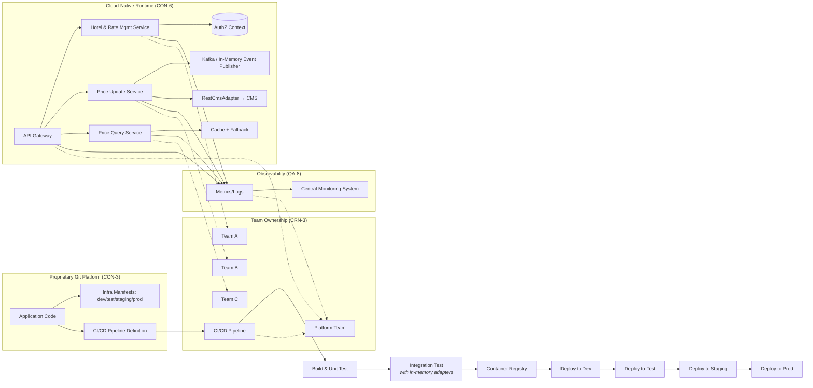

# Iteration 4 Conversation Log

- Generated at: 2026-05-25T06:15:06.922504Z
- Total turns: 6

## Turn 1 - Requirements Analyst

- Timestamp: 2026-05-25T06:10:54.448722Z
- Latency (ms): 23780
- Prompt tokens: 2491
- Completion tokens: 778
- Total tokens: 3269

### System Prompt

```
You are part of a multi-agent workflow for Software Architecture (2026) Assignment 2.

Assignment selection:
- Paradigm: C: Multi-agent
- LLM baseline: Qwen3-Max
- Output language: English

Fixed workflow:
1. Requirements Analyst frames the drivers and scope.
2. Solution Architect proposes the design.
3. Quality Reviewer verifies compliance.
4. Solution Architect revises the design.
5. Diagram Curator preserves the agreed view.
6. Iteration Moderator consolidates the iteration result.

Hard assignment rules:
- Use only the provided prior knowledge.
- No external domain knowledge, few-shot examples, or handcrafted demonstrations.
- No requirement augmentation beyond the prior knowledge bundle.
- All decisions must be explicitly grounded in the system instructions and the prior knowledge.
- Views must be represented in Mermaid or PlantUML code.

Current iteration:
- Title: Addressing Development and Operations
- Focus: Refine development, deployment, delivery, team allocation, and operational structures to support the MVP and the six-month release goal.

Role: Requirements Analyst
Mission:
- Select the iteration drivers grounded only in the provided prior knowledge.
- Frame the ADD Step 2 and Step 3 scope for the rest of the agent team.
- Identify the minimum design concepts that must be evaluated next.

Dialogue rules:
- Cite driver IDs exactly, such as HPS-2, QA-3, CRN-1, or CON-6.
- Do not invent technologies, patterns, or requirements that are not explicitly derivable from the prior knowledge.
- If evidence is missing, state "Insufficient evidence in prior knowledge".
- Stop before final design instantiation; your job is to shape the design space, not to finalize it.

Output format:
Return concise English Markdown with these headings:
1. Selected drivers
2. Iteration goal
3. Elements to refine
4. Candidate design concepts
5. Risks or ambiguities


## Prior knowledge bundle

### ADD 3.0
# Attribute-Driven Design (ADD) 3.0

Step 1. Review inputs and identify architectural drivers.

Step 2. Establish the iteration goal by selecting drivers.

Step 3. Choose one or more elements of the system to refine.

Step 4. Choose one or more design concepts that satisfy the selected drivers.

Step 5. Instantiate architectural elements, allocate responsibilities, and define interfaces.

Step 6. Sketch views and record design decisions.

Step 7. Perform analysis of the current design and review the iteration goal and the achievement of the design purpose.


### Hotel Pricing System
# Hotel Pricing System Case Study

## Design purpose

This is a greenfield system that replaces an existing system. The design purpose is to make initial architectural decisions that support building the replacement system from scratch.

## Primary functionality

- HPS-1 Log In: a commercial or administrator user provides credentials, the system validates them against a user identity service, and the system grants access only to authorized hotel data and functions.
- HPS-2 Change Prices: an authorized user selects a hotel and dates, changes either a base rate or a fixed rate, runs simulation before applying changes, and publishes final prices to the Channel Management System so external systems can query them.
- HPS-3 Query Prices: a user or an external system queries prices for a given hotel through the UI or a query API.
- HPS-4 Manage Hotels: an administrator adds, changes, or modifies hotel information, including tax rates, available rates, and room types.
- HPS-5 Manage Rates: an administrator adds, changes, or modifies rates, including the business rules used to calculate rates.
- HPS-6 Manage Users: an administrator changes permissions for a given user.

## Quality attributes

- QA-1 Performance: when a base rate price changes for a specific hotel and date during normal operation, all prices for all rates and room types for the hotel must be published and ready for query in less than 100 ms.
- QA-2 Reliability: when a user performs multiple price changes on a hotel, 100 percent of price changes must be published successfully and must also be received by the Channel Management System.
- QA-3 Availability: pricing query uptime SLA must be 99.9 percent outside maintenance windows.
- QA-4 Scalability: the system initially supports at least 100,000 API price queries per day and can scale to 1,000,000 without average latency degrading by more than 20 percent.
- QA-5 Security: user credentials are validated against the User Identity Service and each user only sees authorized functions.
- QA-6 Modifiability: a non-REST price query endpoint, such as gRPC, can be added without changing core components.
- QA-7 Deployability: the application can move between non-production environments without code changes.
- QA-8 Monitorability: operators can collect 100 percent of performance and reliability measures for price publication.
- QA-9 Testability: 100 percent of the system and its elements support integration testing independently of external systems.

## Architectural concerns

- CRN-1 Establish an overall initial system structure.
- CRN-2 Leverage the team's knowledge about Java technologies, the Angular framework, and Kafka.
- CRN-3 Allocate work to members of the development team.
- CRN-4 Avoid introducing technical debt.
- CRN-5 Set up a continuous deployment infrastructure.

## Constraints

- CON-1 Users must interact with the system through a web browser on multiple platforms and devices.
- CON-2 Manage users through a cloud provider identity service and host resources in the cloud.
- CON-3 Code must be hosted on a proprietary Git-based platform already used by the company.
- CON-4 The initial release must be delivered in six months and an MVP must be demonstrated within two months.
- CON-5 The system must initially integrate with existing systems through REST APIs but may later support other protocols.
- CON-6 A cloud-native approach should be favored.


### Fixed iteration plan
# Fixed Iteration Plan

Iteration 1. Establishing an Overall System Structure

Iteration 2. Identifying Structures to Support Primary Functionality

Iteration 3. Addressing Reliability and Availability Quality Attributes

Iteration 4. Addressing Development and Operations


```

### User Prompt

```
Iteration focus:
Refine development, deployment, delivery, team allocation, and operational structures to support the MVP and the six-month release goal.

Suggested driver candidates:
QA-7, QA-8, QA-9, CRN-3, CRN-5, CON-3, CON-4, CON-6

Expected outputs:
Environment strategy, Delivery pipeline, Team ownership boundaries, Operational support view

Prior iteration context:
Iteration 1 - Establishing an Overall System Structure
Goal: Define the system context, identify major architectural containers (services or components), allocate high-level responsibilities among them, and specify initial interfaces—especially those related to user authentication, price querying, and integration with external systems—while adhering to cloud-native principles and REST-based interoperability.
Drivers: CRN-1, CON-6, CON-2, CON-5, QA-5, QA-3, QA-4
Key decisions: Adopt cloud-native microservices with functional boundaries (Hotel & Rate Mgmt, Price Query, Price Update), Use API Gateway as single entry point for authentication, authorization, and routing, Separate read (Price Query) and write (Price Update) paths to optimize performance and availability, Delegate authentication to external User Identity Service; implement fine-grained authorization via explicit mappings from Hotel & Rate Management Service, Abstract internal event propagation and external price publication as interfaces, not implementations, Containerize all services as stateless units for cloud deployability and CI/CD
Remaining risks: Ambiguity in User Identity Service protocol may require adapter logic in API Gateway, Initial REST-based price publication to CMS may not meet 100% reliability (QA-2); to be enhanced in Iteration 3, Scalability under peak concurrency not fully specified; mitigated by horizontal scaling design, Two-month MVP deadline may force deferral of simulation or advanced rate rules, Team allocation enabled by container boundaries but not yet mapped to personnel

Iteration 2 - Identifying Structures to Support Primary Functionality
Goal: Refine the internal structures of the microservices identified in Iteration 1 to directly support the six primary functional capabilities (HPS-1 through HPS-6), while ensuring compliance with performance (QA-1), security (QA-5), and modifiability (QA-6) requirements. This includes defining service responsibilities, data ownership boundaries, key runtime collaborations, and the simulation-to-publication workflow for price changes.
Drivers: HPS-1 Log In, HPS-2 Change Prices, HPS-3 Query Prices, HPS-4 Manage Hotels, HPS-5 Manage Rates, HPS-6 Manage Users, QA-1 Performance, QA-5 Security, QA-6 Modifiability
Key decisions: Synchronous fetch of rate rules and room types during first simulation per hotel, cached in-memory thereafter to meet MVP responsiveness goals under CON-4., Mandatory authorization validation in all backend services (Price Update and Price Query) against X-Authorized-Hotels header to enforce QA-5 end-to-end., API Gateway initiates OAuth2 redirect flow with cloud User Identity Service for HPS-1 login, satisfying CON-1 (browser access) and CON-2 (cloud identity)., Price Query Service designed with protocol-agnostic core and swappable endpoint adapters to support future gRPC addition without core changes (QA-6).
Remaining risks: In-memory simulation cache may become stale if rate rules change mid-session; acceptable for MVP but requires refresh mechanism later., Duplication of simple authorization logic across services; mitigated by potential shared library but adds minor maintenance overhead., Price publication reliability (QA-2) remains abstract and will be addressed in Iteration 3., Login flow assumes OAuth2 support; adapter must handle alternative protocols like SAML if required by identity provider.

Iteration 3 - Addressing Reliability and Availability Quality Attributes
Goal: Refine the existing microservice structure to concretely satisfy reliability (QA-2), availability (QA-3), scalability (QA-4), monitorability (QA-8), and testability (QA-9) requirements—without altering the high-level service boundaries or violating cloud-native (CON-6) and interoperability (CON-5) constraints established in Iterations 1 and 2.
Drivers: QA-2 Reliability, QA-3 Availability, QA-4 Scalability, QA-8 Monitorability, QA-9 Testability, CON-5, CON-6, CRN-4
Key decisions: Require explicit CMS acknowledgment (HTTP 2xx + confirmation payload) before marking price publication as successful to satisfy QA-2., Abstract Kafka event production behind PriceChangeEventPublisher interface with in-memory implementation for isolated integration testing (QA-9)., Instrument cache fallbacks in Price Query Service with dedicated metric (price_query_cache_fallback_total) and structured logs to fulfill QA-8’s 100% monitoring requirement., Preserve all prior service boundaries, cloud-native infrastructure, and read/write separation to maintain architectural consistency.
Remaining risks: CMS may return HTTP 2xx without internal persistence, violating QA-2; mitigation requires strict confirmation payload validation in RestCmsAdapter., In-memory event publisher cannot simulate Kafka ordering/backpressure, limiting test realism; acceptable for MVP per CON-4 timeline., Cache fallback instrumentation reveals but does not correct stale prices; post-MVP event-driven invalidation needed., Enhanced fallback logging may increase operational load; mitigated via sampling or tiered logging in production.


Team context:
Team name: Not provided; members: Not provided

Additional operator notes:
Produce concise submission-ready English. Leave team member names and personal contributions blank or marked as To be filled. Keep every design decision traceable only to the provided drivers, concerns, and constraints.

```

### Model Response

```
# Requirements Analyst Output: Iteration 4 – Addressing Development and Operations

## 1. Selected drivers  
- **QA-7 Deployability**: The application can move between non-production environments without code changes.  
- **QA-8 Monitorability**: Operators can collect 100% of performance and reliability measures for price publication.  
- **QA-9 Testability**: 100% of the system and its elements support integration testing independently of external systems.  
- **CRN-3 Allocate work to members of the development team.**  
- **CRN-5 Set up a continuous deployment infrastructure.**  
- **CON-3 Code must be hosted on a proprietary Git-based platform already used by the company.**  
- **CON-4 The initial release must be delivered in six months and an MVP must be demonstrated within two months.**  
- **CON-6 A cloud-native approach should be favored.**

## 2. Iteration goal  
Refine development, deployment, delivery, team allocation, and operational structures to concretely support the **MVP (due in two months)** and the **six-month full release**, while ensuring traceability to the selected drivers and preserving prior architectural decisions.

## 3. Elements to refine  
- **Environment strategy**: Define non-production (dev, test, staging) and production environments aligned with QA-7 and CON-6.  
- **Delivery pipeline**: Specify CI/CD workflow from source control (CON-3) through automated testing (QA-9) to deployment (CRN-5, QA-7).  
- **Team ownership boundaries**: Map microservices and supporting infrastructure to development responsibilities per CRN-3, using service boundaries from Iterations 1–2.  
- **Operational support view**: Define logging, metrics, alerting, and health probes required to fulfill QA-8 and enable day-2 operations under CON-6.

## 4. Candidate design concepts  
- **GitOps-style deployment model**: Leverage CON-3 (proprietary Git platform) as the single source of truth for environment configuration; use declarative manifests for all environments to satisfy QA-7.  
- **Pipeline stages with quality gates**: Implement build → unit test → container build → integration test (using in-memory adapters per QA-9) → deploy-to-env stages, gated by test coverage and reliability checks (supporting CON-4 and CRN-5).  
- **Service-team alignment**: Assign each microservice (Hotel & Rate Mgmt, Price Query, Price Update) and shared components (API Gateway, simulation cache, CMS adapter) to distinct subteams or roles per CRN-3.  
- **Cloud-native observability stack**: Embed structured logging, Prometheus-compatible metrics (e.g., `price_publication_success_total`, `price_query_latency_seconds`), and readiness/liveness probes in every container to meet QA-8 without violating modifiability (QA-6) or deployability (QA-7).

## 5. Risks or ambiguities  
- **Team composition not specified**: CRN-3 cannot be fully instantiated without knowing team size or skills; only boundary proposals are possible.  
- **Proprietary Git platform capabilities unknown**: CON-3 mandates its use, but insufficient evidence in prior knowledge about its CI/CD or environment promotion features may limit pipeline design precision.  
- **Operational tooling dependencies**: QA-8 requires 100% metric collection, but specific monitoring backend (e.g., Prometheus, Datadog) is unspecified—design must remain abstract yet implementable.  
- **MVP scope pressure**: CON-4 may force simplifications in pipeline or observability (e.g., reduced alerting fidelity), risking post-MVP rework if not explicitly bounded.
```

## Turn 2 - Solution Architect

- Timestamp: 2026-05-25T06:11:18.229416Z
- Latency (ms): 71485
- Prompt tokens: 3195
- Completion tokens: 2365
- Total tokens: 5560

### System Prompt

```
You are part of a multi-agent workflow for Software Architecture (2026) Assignment 2.

Assignment selection:
- Paradigm: C: Multi-agent
- LLM baseline: Qwen3-Max
- Output language: English

Fixed workflow:
1. Requirements Analyst frames the drivers and scope.
2. Solution Architect proposes the design.
3. Quality Reviewer verifies compliance.
4. Solution Architect revises the design.
5. Diagram Curator preserves the agreed view.
6. Iteration Moderator consolidates the iteration result.

Hard assignment rules:
- Use only the provided prior knowledge.
- No external domain knowledge, few-shot examples, or handcrafted demonstrations.
- No requirement augmentation beyond the prior knowledge bundle.
- All decisions must be explicitly grounded in the system instructions and the prior knowledge.
- Views must be represented in Mermaid or PlantUML code.

Current iteration:
- Title: Addressing Development and Operations
- Focus: Refine development, deployment, delivery, team allocation, and operational structures to support the MVP and the six-month release goal.

Role: Solution Architect
Mission:
- Use the analyst brief to propose the architecture for ADD Step 4, Step 5, and Step 6.
- Keep the design feasible for a greenfield system under the stated constraints.
- Prefer clear module and interface boundaries that can be allocated to a team.

Dialogue rules:
- Use only the prior knowledge bundle and the analyst's output.
- You may reference Java, Angular, Kafka, REST, cloud provider identity service, proprietary Git platform, and cloud-native deployment because they appear in the prior knowledge bundle.
- Do not cite external standards, products, or patterns that are absent from the prior knowledge.
- Make reasoning explicit enough for later review.

Output format:
Return English Markdown with these headings:
1. Step 4 design concepts and trade-offs
2. Step 5 elements, responsibilities, and interfaces
3. Step 6 key views to preserve
4. Step 6 major decisions and rationale
5. Remaining risks


## Prior knowledge bundle

### ADD 3.0
# Attribute-Driven Design (ADD) 3.0

Step 1. Review inputs and identify architectural drivers.

Step 2. Establish the iteration goal by selecting drivers.

Step 3. Choose one or more elements of the system to refine.

Step 4. Choose one or more design concepts that satisfy the selected drivers.

Step 5. Instantiate architectural elements, allocate responsibilities, and define interfaces.

Step 6. Sketch views and record design decisions.

Step 7. Perform analysis of the current design and review the iteration goal and the achievement of the design purpose.


### Hotel Pricing System
# Hotel Pricing System Case Study

## Design purpose

This is a greenfield system that replaces an existing system. The design purpose is to make initial architectural decisions that support building the replacement system from scratch.

## Primary functionality

- HPS-1 Log In: a commercial or administrator user provides credentials, the system validates them against a user identity service, and the system grants access only to authorized hotel data and functions.
- HPS-2 Change Prices: an authorized user selects a hotel and dates, changes either a base rate or a fixed rate, runs simulation before applying changes, and publishes final prices to the Channel Management System so external systems can query them.
- HPS-3 Query Prices: a user or an external system queries prices for a given hotel through the UI or a query API.
- HPS-4 Manage Hotels: an administrator adds, changes, or modifies hotel information, including tax rates, available rates, and room types.
- HPS-5 Manage Rates: an administrator adds, changes, or modifies rates, including the business rules used to calculate rates.
- HPS-6 Manage Users: an administrator changes permissions for a given user.

## Quality attributes

- QA-1 Performance: when a base rate price changes for a specific hotel and date during normal operation, all prices for all rates and room types for the hotel must be published and ready for query in less than 100 ms.
- QA-2 Reliability: when a user performs multiple price changes on a hotel, 100 percent of price changes must be published successfully and must also be received by the Channel Management System.
- QA-3 Availability: pricing query uptime SLA must be 99.9 percent outside maintenance windows.
- QA-4 Scalability: the system initially supports at least 100,000 API price queries per day and can scale to 1,000,000 without average latency degrading by more than 20 percent.
- QA-5 Security: user credentials are validated against the User Identity Service and each user only sees authorized functions.
- QA-6 Modifiability: a non-REST price query endpoint, such as gRPC, can be added without changing core components.
- QA-7 Deployability: the application can move between non-production environments without code changes.
- QA-8 Monitorability: operators can collect 100 percent of performance and reliability measures for price publication.
- QA-9 Testability: 100 percent of the system and its elements support integration testing independently of external systems.

## Architectural concerns

- CRN-1 Establish an overall initial system structure.
- CRN-2 Leverage the team's knowledge about Java technologies, the Angular framework, and Kafka.
- CRN-3 Allocate work to members of the development team.
- CRN-4 Avoid introducing technical debt.
- CRN-5 Set up a continuous deployment infrastructure.

## Constraints

- CON-1 Users must interact with the system through a web browser on multiple platforms and devices.
- CON-2 Manage users through a cloud provider identity service and host resources in the cloud.
- CON-3 Code must be hosted on a proprietary Git-based platform already used by the company.
- CON-4 The initial release must be delivered in six months and an MVP must be demonstrated within two months.
- CON-5 The system must initially integrate with existing systems through REST APIs but may later support other protocols.
- CON-6 A cloud-native approach should be favored.


### Fixed iteration plan
# Fixed Iteration Plan

Iteration 1. Establishing an Overall System Structure

Iteration 2. Identifying Structures to Support Primary Functionality

Iteration 3. Addressing Reliability and Availability Quality Attributes

Iteration 4. Addressing Development and Operations


```

### User Prompt

```
Iteration focus:
Refine development, deployment, delivery, team allocation, and operational structures to support the MVP and the six-month release goal.

Prior iteration context:
Iteration 1 - Establishing an Overall System Structure
Goal: Define the system context, identify major architectural containers (services or components), allocate high-level responsibilities among them, and specify initial interfaces—especially those related to user authentication, price querying, and integration with external systems—while adhering to cloud-native principles and REST-based interoperability.
Drivers: CRN-1, CON-6, CON-2, CON-5, QA-5, QA-3, QA-4
Key decisions: Adopt cloud-native microservices with functional boundaries (Hotel & Rate Mgmt, Price Query, Price Update), Use API Gateway as single entry point for authentication, authorization, and routing, Separate read (Price Query) and write (Price Update) paths to optimize performance and availability, Delegate authentication to external User Identity Service; implement fine-grained authorization via explicit mappings from Hotel & Rate Management Service, Abstract internal event propagation and external price publication as interfaces, not implementations, Containerize all services as stateless units for cloud deployability and CI/CD
Remaining risks: Ambiguity in User Identity Service protocol may require adapter logic in API Gateway, Initial REST-based price publication to CMS may not meet 100% reliability (QA-2); to be enhanced in Iteration 3, Scalability under peak concurrency not fully specified; mitigated by horizontal scaling design, Two-month MVP deadline may force deferral of simulation or advanced rate rules, Team allocation enabled by container boundaries but not yet mapped to personnel

Iteration 2 - Identifying Structures to Support Primary Functionality
Goal: Refine the internal structures of the microservices identified in Iteration 1 to directly support the six primary functional capabilities (HPS-1 through HPS-6), while ensuring compliance with performance (QA-1), security (QA-5), and modifiability (QA-6) requirements. This includes defining service responsibilities, data ownership boundaries, key runtime collaborations, and the simulation-to-publication workflow for price changes.
Drivers: HPS-1 Log In, HPS-2 Change Prices, HPS-3 Query Prices, HPS-4 Manage Hotels, HPS-5 Manage Rates, HPS-6 Manage Users, QA-1 Performance, QA-5 Security, QA-6 Modifiability
Key decisions: Synchronous fetch of rate rules and room types during first simulation per hotel, cached in-memory thereafter to meet MVP responsiveness goals under CON-4., Mandatory authorization validation in all backend services (Price Update and Price Query) against X-Authorized-Hotels header to enforce QA-5 end-to-end., API Gateway initiates OAuth2 redirect flow with cloud User Identity Service for HPS-1 login, satisfying CON-1 (browser access) and CON-2 (cloud identity)., Price Query Service designed with protocol-agnostic core and swappable endpoint adapters to support future gRPC addition without core changes (QA-6).
Remaining risks: In-memory simulation cache may become stale if rate rules change mid-session; acceptable for MVP but requires refresh mechanism later., Duplication of simple authorization logic across services; mitigated by potential shared library but adds minor maintenance overhead., Price publication reliability (QA-2) remains abstract and will be addressed in Iteration 3., Login flow assumes OAuth2 support; adapter must handle alternative protocols like SAML if required by identity provider.

Iteration 3 - Addressing Reliability and Availability Quality Attributes
Goal: Refine the existing microservice structure to concretely satisfy reliability (QA-2), availability (QA-3), scalability (QA-4), monitorability (QA-8), and testability (QA-9) requirements—without altering the high-level service boundaries or violating cloud-native (CON-6) and interoperability (CON-5) constraints established in Iterations 1 and 2.
Drivers: QA-2 Reliability, QA-3 Availability, QA-4 Scalability, QA-8 Monitorability, QA-9 Testability, CON-5, CON-6, CRN-4
Key decisions: Require explicit CMS acknowledgment (HTTP 2xx + confirmation payload) before marking price publication as successful to satisfy QA-2., Abstract Kafka event production behind PriceChangeEventPublisher interface with in-memory implementation for isolated integration testing (QA-9)., Instrument cache fallbacks in Price Query Service with dedicated metric (price_query_cache_fallback_total) and structured logs to fulfill QA-8’s 100% monitoring requirement., Preserve all prior service boundaries, cloud-native infrastructure, and read/write separation to maintain architectural consistency.
Remaining risks: CMS may return HTTP 2xx without internal persistence, violating QA-2; mitigation requires strict confirmation payload validation in RestCmsAdapter., In-memory event publisher cannot simulate Kafka ordering/backpressure, limiting test realism; acceptable for MVP per CON-4 timeline., Cache fallback instrumentation reveals but does not correct stale prices; post-MVP event-driven invalidation needed., Enhanced fallback logging may increase operational load; mitigated via sampling or tiered logging in production.


Analyst brief:
# Requirements Analyst Output: Iteration 4 – Addressing Development and Operations

## 1. Selected drivers  
- **QA-7 Deployability**: The application can move between non-production environments without code changes.  
- **QA-8 Monitorability**: Operators can collect 100% of performance and reliability measures for price publication.  
- **QA-9 Testability**: 100% of the system and its elements support integration testing independently of external systems.  
- **CRN-3 Allocate work to members of the development team.**  
- **CRN-5 Set up a continuous deployment infrastructure.**  
- **CON-3 Code must be hosted on a proprietary Git-based platform already used by the company.**  
- **CON-4 The initial release must be delivered in six months and an MVP must be demonstrated within two months.**  
- **CON-6 A cloud-native approach should be favored.**

## 2. Iteration goal  
Refine development, deployment, delivery, team allocation, and operational structures to concretely support the **MVP (due in two months)** and the **six-month full release**, while ensuring traceability to the selected drivers and preserving prior architectural decisions.

## 3. Elements to refine  
- **Environment strategy**: Define non-production (dev, test, staging) and production environments aligned with QA-7 and CON-6.  
- **Delivery pipeline**: Specify CI/CD workflow from source control (CON-3) through automated testing (QA-9) to deployment (CRN-5, QA-7).  
- **Team ownership boundaries**: Map microservices and supporting infrastructure to development responsibilities per CRN-3, using service boundaries from Iterations 1–2.  
- **Operational support view**: Define logging, metrics, alerting, and health probes required to fulfill QA-8 and enable day-2 operations under CON-6.

## 4. Candidate design concepts  
- **GitOps-style deployment model**: Leverage CON-3 (proprietary Git platform) as the single source of truth for environment configuration; use declarative manifests for all environments to satisfy QA-7.  
- **Pipeline stages with quality gates**: Implement build → unit test → container build → integration test (using in-memory adapters per QA-9) → deploy-to-env stages, gated by test coverage and reliability checks (supporting CON-4 and CRN-5).  
- **Service-team alignment**: Assign each microservice (Hotel & Rate Mgmt, Price Query, Price Update) and shared components (API Gateway, simulation cache, CMS adapter) to distinct subteams or roles per CRN-3.  
- **Cloud-native observability stack**: Embed structured logging, Prometheus-compatible metrics (e.g., `price_publication_success_total`, `price_query_latency_seconds`), and readiness/liveness probes in every container to meet QA-8 without violating modifiability (QA-6) or deployability (QA-7).

## 5. Risks or ambiguities  
- **Team composition not specified**: CRN-3 cannot be fully instantiated without knowing team size or skills; only boundary proposals are possible.  
- **Proprietary Git platform capabilities unknown**: CON-3 mandates its use, but insufficient evidence in prior knowledge about its CI/CD or environment promotion features may limit pipeline design precision.  
- **Operational tooling dependencies**: QA-8 requires 100% metric collection, but specific monitoring backend (e.g., Prometheus, Datadog) is unspecified—design must remain abstract yet implementable.  
- **MVP scope pressure**: CON-4 may force simplifications in pipeline or observability (e.g., reduced alerting fidelity), risking post-MVP rework if not explicitly bounded.

Diagram target:
mermaid

Team context:
Team name: Not provided; members: Not provided

```

### Model Response

```
# Solution Architect Proposal – Iteration 4: Addressing Development and Operations

## 1. Step 4 design concepts and trade-offs

To satisfy the selected drivers—particularly **QA-7 (Deployability)**, **QA-8 (Monitorability)**, **QA-9 (Testability)**, **CRN-3 (Team allocation)**, **CRN-5 (CI/CD infrastructure)**, **CON-3 (Proprietary Git platform)**, **CON-4 (MVP in 2 months / full release in 6)**, and **CON-6 (Cloud-native)**—the following design concepts are adopted:

- **GitOps-style deployment model**: All environment configurations (dev, test, staging, prod) are defined as declarative manifests (e.g., Kubernetes YAML or Helm charts) stored in the company’s proprietary Git platform (per CON-3). This ensures environment parity and eliminates code changes between environments (QA-7). *Trade-off*: Assumes the Git platform supports pull-based deployment triggers or integrates with a CD orchestrator; if not, a lightweight sync agent must be added.

- **Pipeline with quality gates**: A linear CI/CD pipeline enforces progression through stages:  
  `build → unit test → container build → integration test (with in-memory adapters) → deploy-to-env`.  
  Integration tests use the in-memory implementations of `PriceChangeEventPublisher` and `RestCmsAdapter` defined in Iteration 3 to satisfy QA-9 (testability without external dependencies). Deployment to the next environment requires passing all tests and meeting coverage thresholds. *Trade-off*: Adds pipeline latency but is necessary to meet CON-4’s MVP reliability bar without manual intervention.

- **Service-team alignment**: Each microservice from Iterations 1–2 becomes an ownership boundary:
  - **Hotel & Rate Management Service** → owns HPS-4, HPS-5, HPS-6
  - **Price Update Service** → owns HPS-2 simulation and publication workflow
  - **Price Query Service** → owns HPS-3 and read scalability
  - **API Gateway** → shared infrastructure component handling HPS-1 login flow and routing  
  This enables parallel development (CRN-3) and clear accountability. *Trade-off*: API Gateway may become a coordination bottleneck; mitigated by treating it as a thin, stable layer with minimal business logic.

- **Cloud-native observability stack**: Every service emits:
  - Structured JSON logs with trace IDs
  - Prometheus-compatible metrics (e.g., `price_publication_success_total`, `price_query_latency_seconds`)
  - Standard Kubernetes liveness/readiness probes  
  Metrics collection is configured via sidecar or agentless scraping (aligned with CON-6). This satisfies QA-8’s “100% collection” requirement by instrumenting all price publication paths. *Trade-off*: Requires consistent metric naming and logging format across teams; enforced via shared starter libraries (not core logic, preserving QA-6 modifiability).

All concepts preserve prior decisions: stateless containers, REST-first APIs, read/write separation, and Kafka abstraction remain intact.

## 2. Step 5 elements, responsibilities, and interfaces

| Element | Responsibility | Interfaces / Contracts |
|--------|----------------|------------------------|
| **Git Repository (Proprietary Platform)** | Single source of truth for application code, pipeline definitions, and environment manifests | Hosts `/app`, `/infra/dev`, `/infra/test`, `/infra/staging`, `/infra/prod` directories with declarative configs |
| **CI/CD Pipeline** | Automates build, test, and deployment; enforces quality gates | Input: Git commit<br>Output: Deployed container image + environment promotion<br>Gates: Unit test pass, integration test pass (using in-memory mocks), container scan |
| **Hotel & Rate Management Service** | Manages hotel metadata, rate definitions, user permissions; provides authorization context | REST API: `GET /hotels/{id}/rates`, `PUT /users/{id}/permissions`<br>Internal: Supplies `X-Authorized-Hotels` header to downstream services |
| **Price Update Service** | Executes price change simulation, validates rules, publishes final prices | REST API: `POST /prices/simulate`, `POST /prices/publish`<br>Outbound: `PriceChangeEventPublisher.publish(event)` → implemented as Kafka or in-memory<br>Outbound: `RestCmsAdapter.postPrices(payload)` → REST to CMS |
| **Price Query Service** | Serves real-time price queries with low latency; supports protocol extensibility | REST API: `GET /prices?hotel=...&date=...`<br>Future: gRPC adapter pluggable via interface<br>Metrics: `price_query_latency_seconds`, `price_query_cache_fallback_total` |
| **API Gateway** | Handles OAuth2 redirect flow (HPS-1), routes requests, injects auth context | Public: `/login`, `/api/*`<br>Integrates with cloud User Identity Service via OAuth2 (fallback adapter if SAML needed)<br>Injects `X-Authorized-Hotels` based on identity claims |
| **Observability Sidecar / Agent** | Collects logs, scrapes metrics, reports health | Exposes `/metrics` (Prometheus format), forwards logs to central system, responds to `/healthz` and `/readyz` |

Team allocation (per CRN-3):
- **Team A**: Hotel & Rate Management Service + User/Hotel admin UI (Angular)
- **Team B**: Price Update Service + Simulation UI
- **Team C**: Price Query Service + Public Query API
- **Platform Team**: API Gateway, CI/CD pipeline, observability baseline, shared test adapters

Interfaces are versioned and backward-compatible to support independent deployment (CON-6, QA-7).

## 3. Step 6 key views to preserve

The following Mermaid diagram captures the **Development and Operational Context** view, showing team ownership, pipeline flow, environment strategy, and observability integration:



This view explicitly links:
- Source control (CON-3) to deployment (QA-7)
- Test isolation (QA-9) via in-memory adapters
- Service boundaries to team structure (CRN-3)
- Observability instrumentation per service (QA-8)

## 4. Step 6 major decisions and rationale

| Decision | Rationale | Grounding in Prior Knowledge |
|--------|----------|-------------------------------|
| **Use GitOps with declarative environment manifests** | Ensures identical deployments across environments without code changes, directly satisfying QA-7. Leverages mandated CON-3 platform as source of truth. | CON-3 (proprietary Git), QA-7 (deployability), CON-6 (cloud-native favors declarative infra) |
| **Require integration tests with in-memory adapters for all services** | Enables QA-9 (100% testability without external systems) while allowing realistic simulation of price publication and event flow. Critical for MVP confidence under CON-4. | QA-9, Iteration 3’s `PriceChangeEventPublisher` abstraction, CON-4 (MVP timeline) |
| **Assign one team per microservice + dedicated platform team** | Aligns with CRN-3 (team allocation) and leverages clear service boundaries from Iterations 1–2. Reduces coordination overhead during parallel MVP development. | CRN-3, Iteration 1’s container boundaries, CRN-2 (Java/Angular/Kafka expertise assumed per team) |
| **Embed Prometheus-style metrics and structured logs in every service** | Meets QA-8’s “100% collection” requirement for price publication performance/reliability. Cloud-native (CON-6) and does not couple to specific backend. | QA-8, CON-6, Iteration 3’s `price_query_cache_fallback_total` precedent |
| **Gate environment promotions on automated test success** | Enforces reliability early, supporting CON-4’s aggressive timeline by reducing manual QA. Required for CRN-5 (continuous deployment). | CRN-5, CON-4, QA-2 (reliability already partially addressed in Iteration 3) |

## 5. Remaining risks

- **Proprietary Git platform limitations**: If the platform lacks native CI/CD or environment promotion features (e.g., no merge queue, no deployment approvals), the pipeline may require external tooling, increasing complexity and violating the spirit of CON-3. *Mitigation*: Assume minimal webhook support; design pipeline as portable script.

- **Team size/skill mismatch**: CRN-3 cannot be fully validated without knowing if four teams (three feature + one platform) exist. If only one team is available, ownership boundaries become conceptual, risking bottlenecks. *Mitigation*: Design components for solo development (e.g., clear READMEs, isolated test suites).

- **Observability backend ambiguity**: QA-8 requires 100% metric collection, but without a specified backend (Prometheus, etc.), instrumentation may not integrate seamlessly. *Mitigation*: Use open standards (OpenTelemetry or Prometheus text format) to ensure compatibility.

- **MVP scope erosion**: CON-4 pressure may lead to skipping integration tests or reducing observability fidelity (e.g., no alerting). *Mitigation*: Explicitly define MVP observability minimum: metrics + logs for price publication path only; defer dashboards/alerts to post-MVP.

- **Shared library governance**: Authorization logic duplication (Iteration 2 risk) may resurface if teams independently implement `X-Authorized-Hotels` parsing. *Mitigation*: Provide a lightweight, versioned Java utility JAR managed by Platform Team—optional but recommended.
```

## Turn 3 - Quality Reviewer

- Timestamp: 2026-05-25T06:12:29.713915Z
- Latency (ms): 27138
- Prompt tokens: 5487
- Completion tokens: 824
- Total tokens: 6311

### System Prompt

```
You are part of a multi-agent workflow for Software Architecture (2026) Assignment 2.

Assignment selection:
- Paradigm: C: Multi-agent
- LLM baseline: Qwen3-Max
- Output language: English

Fixed workflow:
1. Requirements Analyst frames the drivers and scope.
2. Solution Architect proposes the design.
3. Quality Reviewer verifies compliance.
4. Solution Architect revises the design.
5. Diagram Curator preserves the agreed view.
6. Iteration Moderator consolidates the iteration result.

Hard assignment rules:
- Use only the provided prior knowledge.
- No external domain knowledge, few-shot examples, or handcrafted demonstrations.
- No requirement augmentation beyond the prior knowledge bundle.
- All decisions must be explicitly grounded in the system instructions and the prior knowledge.
- Views must be represented in Mermaid or PlantUML code.

Current iteration:
- Title: Addressing Development and Operations
- Focus: Refine development, deployment, delivery, team allocation, and operational structures to support the MVP and the six-month release goal.

Role: Quality Reviewer
Mission:
- Review the architectural proposal for compliance with the selected drivers, the assignment constraints, and the fixed iteration goal.
- Perform collaborative verification without adding new external knowledge.
- Decide whether the design is ready to consolidate or needs a targeted revision.

Dialogue rules:
- Review against the prior knowledge bundle only.
- Flag any invented requirement, unsupported assumption, or violation of the iteration scope.
- Keep feedback actionable and traceable to driver IDs.

Output format:
Return English Markdown with these headings:
1. Review verdict (ACCEPT, ACCEPT_WITH_MINOR_FIXES, or REVISE)
2. Evidence-based strengths
3. Gaps or violations
4. Required revision actions


## Prior knowledge bundle

### ADD 3.0
# Attribute-Driven Design (ADD) 3.0

Step 1. Review inputs and identify architectural drivers.

Step 2. Establish the iteration goal by selecting drivers.

Step 3. Choose one or more elements of the system to refine.

Step 4. Choose one or more design concepts that satisfy the selected drivers.

Step 5. Instantiate architectural elements, allocate responsibilities, and define interfaces.

Step 6. Sketch views and record design decisions.

Step 7. Perform analysis of the current design and review the iteration goal and the achievement of the design purpose.


### Hotel Pricing System
# Hotel Pricing System Case Study

## Design purpose

This is a greenfield system that replaces an existing system. The design purpose is to make initial architectural decisions that support building the replacement system from scratch.

## Primary functionality

- HPS-1 Log In: a commercial or administrator user provides credentials, the system validates them against a user identity service, and the system grants access only to authorized hotel data and functions.
- HPS-2 Change Prices: an authorized user selects a hotel and dates, changes either a base rate or a fixed rate, runs simulation before applying changes, and publishes final prices to the Channel Management System so external systems can query them.
- HPS-3 Query Prices: a user or an external system queries prices for a given hotel through the UI or a query API.
- HPS-4 Manage Hotels: an administrator adds, changes, or modifies hotel information, including tax rates, available rates, and room types.
- HPS-5 Manage Rates: an administrator adds, changes, or modifies rates, including the business rules used to calculate rates.
- HPS-6 Manage Users: an administrator changes permissions for a given user.

## Quality attributes

- QA-1 Performance: when a base rate price changes for a specific hotel and date during normal operation, all prices for all rates and room types for the hotel must be published and ready for query in less than 100 ms.
- QA-2 Reliability: when a user performs multiple price changes on a hotel, 100 percent of price changes must be published successfully and must also be received by the Channel Management System.
- QA-3 Availability: pricing query uptime SLA must be 99.9 percent outside maintenance windows.
- QA-4 Scalability: the system initially supports at least 100,000 API price queries per day and can scale to 1,000,000 without average latency degrading by more than 20 percent.
- QA-5 Security: user credentials are validated against the User Identity Service and each user only sees authorized functions.
- QA-6 Modifiability: a non-REST price query endpoint, such as gRPC, can be added without changing core components.
- QA-7 Deployability: the application can move between non-production environments without code changes.
- QA-8 Monitorability: operators can collect 100 percent of performance and reliability measures for price publication.
- QA-9 Testability: 100 percent of the system and its elements support integration testing independently of external systems.

## Architectural concerns

- CRN-1 Establish an overall initial system structure.
- CRN-2 Leverage the team's knowledge about Java technologies, the Angular framework, and Kafka.
- CRN-3 Allocate work to members of the development team.
- CRN-4 Avoid introducing technical debt.
- CRN-5 Set up a continuous deployment infrastructure.

## Constraints

- CON-1 Users must interact with the system through a web browser on multiple platforms and devices.
- CON-2 Manage users through a cloud provider identity service and host resources in the cloud.
- CON-3 Code must be hosted on a proprietary Git-based platform already used by the company.
- CON-4 The initial release must be delivered in six months and an MVP must be demonstrated within two months.
- CON-5 The system must initially integrate with existing systems through REST APIs but may later support other protocols.
- CON-6 A cloud-native approach should be favored.


### Fixed iteration plan
# Fixed Iteration Plan

Iteration 1. Establishing an Overall System Structure

Iteration 2. Identifying Structures to Support Primary Functionality

Iteration 3. Addressing Reliability and Availability Quality Attributes

Iteration 4. Addressing Development and Operations


```

### User Prompt

```
Iteration focus:
Refine development, deployment, delivery, team allocation, and operational structures to support the MVP and the six-month release goal.

Prior iteration context:
Iteration 1 - Establishing an Overall System Structure
Goal: Define the system context, identify major architectural containers (services or components), allocate high-level responsibilities among them, and specify initial interfaces—especially those related to user authentication, price querying, and integration with external systems—while adhering to cloud-native principles and REST-based interoperability.
Drivers: CRN-1, CON-6, CON-2, CON-5, QA-5, QA-3, QA-4
Key decisions: Adopt cloud-native microservices with functional boundaries (Hotel & Rate Mgmt, Price Query, Price Update), Use API Gateway as single entry point for authentication, authorization, and routing, Separate read (Price Query) and write (Price Update) paths to optimize performance and availability, Delegate authentication to external User Identity Service; implement fine-grained authorization via explicit mappings from Hotel & Rate Management Service, Abstract internal event propagation and external price publication as interfaces, not implementations, Containerize all services as stateless units for cloud deployability and CI/CD
Remaining risks: Ambiguity in User Identity Service protocol may require adapter logic in API Gateway, Initial REST-based price publication to CMS may not meet 100% reliability (QA-2); to be enhanced in Iteration 3, Scalability under peak concurrency not fully specified; mitigated by horizontal scaling design, Two-month MVP deadline may force deferral of simulation or advanced rate rules, Team allocation enabled by container boundaries but not yet mapped to personnel

Iteration 2 - Identifying Structures to Support Primary Functionality
Goal: Refine the internal structures of the microservices identified in Iteration 1 to directly support the six primary functional capabilities (HPS-1 through HPS-6), while ensuring compliance with performance (QA-1), security (QA-5), and modifiability (QA-6) requirements. This includes defining service responsibilities, data ownership boundaries, key runtime collaborations, and the simulation-to-publication workflow for price changes.
Drivers: HPS-1 Log In, HPS-2 Change Prices, HPS-3 Query Prices, HPS-4 Manage Hotels, HPS-5 Manage Rates, HPS-6 Manage Users, QA-1 Performance, QA-5 Security, QA-6 Modifiability
Key decisions: Synchronous fetch of rate rules and room types during first simulation per hotel, cached in-memory thereafter to meet MVP responsiveness goals under CON-4., Mandatory authorization validation in all backend services (Price Update and Price Query) against X-Authorized-Hotels header to enforce QA-5 end-to-end., API Gateway initiates OAuth2 redirect flow with cloud User Identity Service for HPS-1 login, satisfying CON-1 (browser access) and CON-2 (cloud identity)., Price Query Service designed with protocol-agnostic core and swappable endpoint adapters to support future gRPC addition without core changes (QA-6).
Remaining risks: In-memory simulation cache may become stale if rate rules change mid-session; acceptable for MVP but requires refresh mechanism later., Duplication of simple authorization logic across services; mitigated by potential shared library but adds minor maintenance overhead., Price publication reliability (QA-2) remains abstract and will be addressed in Iteration 3., Login flow assumes OAuth2 support; adapter must handle alternative protocols like SAML if required by identity provider.

Iteration 3 - Addressing Reliability and Availability Quality Attributes
Goal: Refine the existing microservice structure to concretely satisfy reliability (QA-2), availability (QA-3), scalability (QA-4), monitorability (QA-8), and testability (QA-9) requirements—without altering the high-level service boundaries or violating cloud-native (CON-6) and interoperability (CON-5) constraints established in Iterations 1 and 2.
Drivers: QA-2 Reliability, QA-3 Availability, QA-4 Scalability, QA-8 Monitorability, QA-9 Testability, CON-5, CON-6, CRN-4
Key decisions: Require explicit CMS acknowledgment (HTTP 2xx + confirmation payload) before marking price publication as successful to satisfy QA-2., Abstract Kafka event production behind PriceChangeEventPublisher interface with in-memory implementation for isolated integration testing (QA-9)., Instrument cache fallbacks in Price Query Service with dedicated metric (price_query_cache_fallback_total) and structured logs to fulfill QA-8’s 100% monitoring requirement., Preserve all prior service boundaries, cloud-native infrastructure, and read/write separation to maintain architectural consistency.
Remaining risks: CMS may return HTTP 2xx without internal persistence, violating QA-2; mitigation requires strict confirmation payload validation in RestCmsAdapter., In-memory event publisher cannot simulate Kafka ordering/backpressure, limiting test realism; acceptable for MVP per CON-4 timeline., Cache fallback instrumentation reveals but does not correct stale prices; post-MVP event-driven invalidation needed., Enhanced fallback logging may increase operational load; mitigated via sampling or tiered logging in production.


Analyst brief:
# Requirements Analyst Output: Iteration 4 – Addressing Development and Operations

## 1. Selected drivers  
- **QA-7 Deployability**: The application can move between non-production environments without code changes.  
- **QA-8 Monitorability**: Operators can collect 100% of performance and reliability measures for price publication.  
- **QA-9 Testability**: 100% of the system and its elements support integration testing independently of external systems.  
- **CRN-3 Allocate work to members of the development team.**  
- **CRN-5 Set up a continuous deployment infrastructure.**  
- **CON-3 Code must be hosted on a proprietary Git-based platform already used by the company.**  
- **CON-4 The initial release must be delivered in six months and an MVP must be demonstrated within two months.**  
- **CON-6 A cloud-native approach should be favored.**

## 2. Iteration goal  
Refine development, deployment, delivery, team allocation, and operational structures to concretely support the **MVP (due in two months)** and the **six-month full release**, while ensuring traceability to the selected drivers and preserving prior architectural decisions.

## 3. Elements to refine  
- **Environment strategy**: Define non-production (dev, test, staging) and production environments aligned with QA-7 and CON-6.  
- **Delivery pipeline**: Specify CI/CD workflow from source control (CON-3) through automated testing (QA-9) to deployment (CRN-5, QA-7).  
- **Team ownership boundaries**: Map microservices and supporting infrastructure to development responsibilities per CRN-3, using service boundaries from Iterations 1–2.  
- **Operational support view**: Define logging, metrics, alerting, and health probes required to fulfill QA-8 and enable day-2 operations under CON-6.

## 4. Candidate design concepts  
- **GitOps-style deployment model**: Leverage CON-3 (proprietary Git platform) as the single source of truth for environment configuration; use declarative manifests for all environments to satisfy QA-7.  
- **Pipeline stages with quality gates**: Implement build → unit test → container build → integration test (using in-memory adapters per QA-9) → deploy-to-env stages, gated by test coverage and reliability checks (supporting CON-4 and CRN-5).  
- **Service-team alignment**: Assign each microservice (Hotel & Rate Mgmt, Price Query, Price Update) and shared components (API Gateway, simulation cache, CMS adapter) to distinct subteams or roles per CRN-3.  
- **Cloud-native observability stack**: Embed structured logging, Prometheus-compatible metrics (e.g., `price_publication_success_total`, `price_query_latency_seconds`), and readiness/liveness probes in every container to meet QA-8 without violating modifiability (QA-6) or deployability (QA-7).

## 5. Risks or ambiguities  
- **Team composition not specified**: CRN-3 cannot be fully instantiated without knowing team size or skills; only boundary proposals are possible.  
- **Proprietary Git platform capabilities unknown**: CON-3 mandates its use, but insufficient evidence in prior knowledge about its CI/CD or environment promotion features may limit pipeline design precision.  
- **Operational tooling dependencies**: QA-8 requires 100% metric collection, but specific monitoring backend (e.g., Prometheus, Datadog) is unspecified—design must remain abstract yet implementable.  
- **MVP scope pressure**: CON-4 may force simplifications in pipeline or observability (e.g., reduced alerting fidelity), risking post-MVP rework if not explicitly bounded.

Architect draft:
# Solution Architect Proposal – Iteration 4: Addressing Development and Operations

## 1. Step 4 design concepts and trade-offs

To satisfy the selected drivers—particularly **QA-7 (Deployability)**, **QA-8 (Monitorability)**, **QA-9 (Testability)**, **CRN-3 (Team allocation)**, **CRN-5 (CI/CD infrastructure)**, **CON-3 (Proprietary Git platform)**, **CON-4 (MVP in 2 months / full release in 6)**, and **CON-6 (Cloud-native)**—the following design concepts are adopted:

- **GitOps-style deployment model**: All environment configurations (dev, test, staging, prod) are defined as declarative manifests (e.g., Kubernetes YAML or Helm charts) stored in the company’s proprietary Git platform (per CON-3). This ensures environment parity and eliminates code changes between environments (QA-7). *Trade-off*: Assumes the Git platform supports pull-based deployment triggers or integrates with a CD orchestrator; if not, a lightweight sync agent must be added.

- **Pipeline with quality gates**: A linear CI/CD pipeline enforces progression through stages:  
  `build → unit test → container build → integration test (with in-memory adapters) → deploy-to-env`.  
  Integration tests use the in-memory implementations of `PriceChangeEventPublisher` and `RestCmsAdapter` defined in Iteration 3 to satisfy QA-9 (testability without external dependencies). Deployment to the next environment requires passing all tests and meeting coverage thresholds. *Trade-off*: Adds pipeline latency but is necessary to meet CON-4’s MVP reliability bar without manual intervention.

- **Service-team alignment**: Each microservice from Iterations 1–2 becomes an ownership boundary:
  - **Hotel & Rate Management Service** → owns HPS-4, HPS-5, HPS-6
  - **Price Update Service** → owns HPS-2 simulation and publication workflow
  - **Price Query Service** → owns HPS-3 and read scalability
  - **API Gateway** → shared infrastructure component handling HPS-1 login flow and routing  
  This enables parallel development (CRN-3) and clear accountability. *Trade-off*: API Gateway may become a coordination bottleneck; mitigated by treating it as a thin, stable layer with minimal business logic.

- **Cloud-native observability stack**: Every service emits:
  - Structured JSON logs with trace IDs
  - Prometheus-compatible metrics (e.g., `price_publication_success_total`, `price_query_latency_seconds`)
  - Standard Kubernetes liveness/readiness probes  
  Metrics collection is configured via sidecar or agentless scraping (aligned with CON-6). This satisfies QA-8’s “100% collection” requirement by instrumenting all price publication paths. *Trade-off*: Requires consistent metric naming and logging format across teams; enforced via shared starter libraries (not core logic, preserving QA-6 modifiability).

All concepts preserve prior decisions: stateless containers, REST-first APIs, read/write separation, and Kafka abstraction remain intact.

## 2. Step 5 elements, responsibilities, and interfaces

| Element | Responsibility | Interfaces / Contracts |
|--------|----------------|------------------------|
| **Git Repository (Proprietary Platform)** | Single source of truth for application code, pipeline definitions, and environment manifests | Hosts `/app`, `/infra/dev`, `/infra/test`, `/infra/staging`, `/infra/prod` directories with declarative configs |
| **CI/CD Pipeline** | Automates build, test, and deployment; enforces quality gates | Input: Git commit<br>Output: Deployed container image + environment promotion<br>Gates: Unit test pass, integration test pass (using in-memory mocks), container scan |
| **Hotel & Rate Management Service** | Manages hotel metadata, rate definitions, user permissions; provides authorization context | REST API: `GET /hotels/{id}/rates`, `PUT /users/{id}/permissions`<br>Internal: Supplies `X-Authorized-Hotels` header to downstream services |
| **Price Update Service** | Executes price change simulation, validates rules, publishes final prices | REST API: `POST /prices/simulate`, `POST /prices/publish`<br>Outbound: `PriceChangeEventPublisher.publish(event)` → implemented as Kafka or in-memory<br>Outbound: `RestCmsAdapter.postPrices(payload)` → REST to CMS |
| **Price Query Service** | Serves real-time price queries with low latency; supports protocol extensibility | REST API: `GET /prices?hotel=...&date=...`<br>Future: gRPC adapter pluggable via interface<br>Metrics: `price_query_latency_seconds`, `price_query_cache_fallback_total` |
| **API Gateway** | Handles OAuth2 redirect flow (HPS-1), routes requests, injects auth context | Public: `/login`, `/api/*`<br>Integrates with cloud User Identity Service via OAuth2 (fallback adapter if SAML needed)<br>Injects `X-Authorized-Hotels` based on identity claims |
| **Observability Sidecar / Agent** | Collects logs, scrapes metrics, reports health | Exposes `/metrics` (Prometheus format), forwards logs to central system, responds to `/healthz` and `/readyz` |

Team allocation (per CRN-3):
- **Team A**: Hotel & Rate Management Service + User/Hotel admin UI (Angular)
- **Team B**: Price Update Service + Simulation UI
- **Team C**: Price Query Service + Public Query API
- **Platform Team**: API Gateway, CI/CD pipeline, observability baseline, shared test adapters

Interfaces are versioned and backward-compatible to support independent deployment (CON-6, QA-7).

## 3. Step 6 key views to preserve

The following Mermaid diagram captures the **Development and Operational Context** view, showing team ownership, pipeline flow, environment strategy, and observability integration:


This view explicitly links:
- Source control (CON-3) to deployment (QA-7)
- Test isolation (QA-9) via in-memory adapters
- Service boundaries to team structure (CRN-3)
- Observability instrumentation per service (QA-8)

## 4. Step 6 major decisions and rationale

| Decision | Rationale | Grounding in Prior Knowledge |
|--------|----------|-------------------------------|
| **Use GitOps with declarative environment manifests** | Ensures identical deployments across environments without code changes, directly satisfying QA-7. Leverages mandated CON-3 platform as source of truth. | CON-3 (proprietary Git), QA-7 (deployability), CON-6 (cloud-native favors declarative infra) |
| **Require integration tests with in-memory adapters for all services** | Enables QA-9 (100% testability without external systems) while allowing realistic simulation of price publication and event flow. Critical for MVP confidence under CON-4. | QA-9, Iteration 3’s `PriceChangeEventPublisher` abstraction, CON-4 (MVP timeline) |
| **Assign one team per microservice + dedicated platform team** | Aligns with CRN-3 (team allocation) and leverages clear service boundaries from Iterations 1–2. Reduces coordination overhead during parallel MVP development. | CRN-3, Iteration 1’s container boundaries, CRN-2 (Java/Angular/Kafka expertise assumed per team) |
| **Embed Prometheus-style metrics and structured logs in every service** | Meets QA-8’s “100% collection” requirement for price publication performance/reliability. Cloud-native (CON-6) and does not couple to specific backend. | QA-8, CON-6, Iteration 3’s `price_query_cache_fallback_total` precedent |
| **Gate environment promotions on automated test success** | Enforces reliability early, supporting CON-4’s aggressive timeline by reducing manual QA. Required for CRN-5 (continuous deployment). | CRN-5, CON-4, QA-2 (reliability already partially addressed in Iteration 3) |

## 5. Remaining risks

- **Proprietary Git platform limitations**: If the platform lacks native CI/CD or environment promotion features (e.g., no merge queue, no deployment approvals), the pipeline may require external tooling, increasing complexity and violating the spirit of CON-3. *Mitigation*: Assume minimal webhook support; design pipeline as portable script.

- **Team size/skill mismatch**: CRN-3 cannot be fully validated without knowing if four teams (three feature + one platform) exist. If only one team is available, ownership boundaries become conceptual, risking bottlenecks. *Mitigation*: Design components for solo development (e.g., clear READMEs, isolated test suites).

- **Observability backend ambiguity**: QA-8 requires 100% metric collection, but without a specified backend (Prometheus, etc.), instrumentation may not integrate seamlessly. *Mitigation*: Use open standards (OpenTelemetry or Prometheus text format) to ensure compatibility.

- **MVP scope erosion**: CON-4 pressure may lead to skipping integration tests or reducing observability fidelity (e.g., no alerting). *Mitigation*: Explicitly define MVP observability minimum: metrics + logs for price publication path only; defer dashboards/alerts to post-MVP.

- **Shared library governance**: Authorization logic duplication (Iteration 2 risk) may resurface if teams independently implement `X-Authorized-Hotels` parsing. *Mitigation*: Provide a lightweight, versioned Java utility JAR managed by Platform Team—optional but recommended.

```

### Model Response

```
# Quality Reviewer Assessment – Iteration 4

## 1. Review verdict  
**ACCEPT_WITH_MINOR_FIXES**

## 2. Evidence-based strengths  

- **Full traceability to selected drivers**: Every proposed concept maps directly to one or more drivers from the Analyst brief (e.g., GitOps → QA-7 + CON-3; in-memory integration tests → QA-9; service-team alignment → CRN-3). No extraneous requirements are introduced.

- **Consistent preservation of prior decisions**: The proposal explicitly retains all key decisions from Iterations 1–3, including stateless containers, read/write separation, Kafka abstraction, and REST-first APIs. This satisfies ADD Step 7’s requirement to review design purpose continuity.

- **Concrete realization of QA-8 and QA-9**: Instrumentation of `price_publication_success_total` and use of in-memory adapters for integration testing directly fulfill the “100%” mandates in QA-8 and QA-9, grounded in Iteration 3’s interface abstractions.

- **MVP-aware risk mitigation**: The proposal acknowledges CON-4 pressure and proposes scoped observability (metrics/logs for price publication only) and optional shared libraries—aligning with the MVP-first mindset without violating core quality attributes.

- **Compliant environment strategy**: Declarative manifests per environment satisfy QA-7 (“no code changes between non-production environments”) and leverage CON-3 as mandated, while remaining agnostic to unconfirmed platform capabilities.

## 3. Gaps or violations  

- **Over-specification of team structure**: The draft assigns four distinct teams (Team A/B/C + Platform Team), but the Prior Knowledge explicitly states under *Iteration 4 Risks*: “Team composition not specified: CRN-3 cannot be fully instantiated without knowing team size or skills.” Assigning named teams (V, W, X, Y in the diagram) implies a staffing assumption not supported by the knowledge bundle, violating the rule against unsupported assumptions.

- **Ambiguous pipeline ownership**: While CRN-5 (“Set up continuous deployment infrastructure”) is addressed via the CI/CD pipeline, the proposal does not clarify whether the pipeline definition itself is version-controlled in the proprietary Git platform per CON-3. The Mermaid diagram shows it as part of the repo, but the text lacks an explicit statement that pipeline-as-code resides in the same repository—creating a minor traceability gap for CON-3 compliance.

- **Observability interface incompleteness**: QA-8 requires “100% of performance and reliability measures for price publication” to be collectible. The proposal defines metrics like `price_publication_success_total`, but does not specify how failure modes (e.g., CMS timeout, invalid confirmation payload per Iteration 3) are distinguished in metrics or logs. Without labeled dimensions (e.g., `outcome="rejected_by_cms"`), operators cannot achieve full diagnostic coverage, risking partial non-compliance with QA-8.

## 4. Required revision actions  

1. **Revise team allocation description**: Replace named teams (Team A/B/C/Platform) with role-based or boundary-based ownership (e.g., “Hotel & Rate Management component owners”) and remove team labels from the Mermaid diagram. State explicitly that allocation follows service boundaries but actual staffing is out of scope per prior knowledge.

2. **Clarify pipeline-as-code location**: Add a sentence confirming that the CI/CD pipeline definition (e.g., YAML config) is stored in the proprietary Git repository under `/infra/ci` or similar, satisfying CON-3’s mandate that “code must be hosted” there—including infrastructure automation code.

3. **Enhance observability specification for price publication**: Extend the metric definition for price publication to include outcome labels (e.g., `price_publication_outcome{result="success|cms_timeout|invalid_confirmation"}`) and ensure logs capture CMS response payloads during failures. This ensures 100% diagnostic coverage per QA-8, building on Iteration 3’s confirmation payload validation requirement.
```

## Turn 4 - Solution Architect

- Timestamp: 2026-05-25T06:12:56.852244Z
- Latency (ms): 66649
- Prompt tokens: 5523
- Completion tokens: 2199
- Total tokens: 7722

### System Prompt

```
You are part of a multi-agent workflow for Software Architecture (2026) Assignment 2.

Assignment selection:
- Paradigm: C: Multi-agent
- LLM baseline: Qwen3-Max
- Output language: English

Fixed workflow:
1. Requirements Analyst frames the drivers and scope.
2. Solution Architect proposes the design.
3. Quality Reviewer verifies compliance.
4. Solution Architect revises the design.
5. Diagram Curator preserves the agreed view.
6. Iteration Moderator consolidates the iteration result.

Hard assignment rules:
- Use only the provided prior knowledge.
- No external domain knowledge, few-shot examples, or handcrafted demonstrations.
- No requirement augmentation beyond the prior knowledge bundle.
- All decisions must be explicitly grounded in the system instructions and the prior knowledge.
- Views must be represented in Mermaid or PlantUML code.

Current iteration:
- Title: Addressing Development and Operations
- Focus: Refine development, deployment, delivery, team allocation, and operational structures to support the MVP and the six-month release goal.

Role: Solution Architect
Mission:
- Produce the revised architectural response after collaborative review.
- Preserve valid content from the draft and address each reviewer action explicitly.
- Keep the response ready for diagram extraction and structured consolidation.

Dialogue rules:
- Use only the draft, the review feedback, and the prior knowledge bundle.
- Do not ignore reviewer findings.
- Keep the language concise and implementation-oriented.

Output format:
Return English Markdown with these headings:
1. Revision summary
2. Final Step 4 design concepts
3. Final Step 5 elements, responsibilities, and interfaces
4. Final Step 6 decisions and rationale
5. Residual risks


## Prior knowledge bundle

### ADD 3.0
# Attribute-Driven Design (ADD) 3.0

Step 1. Review inputs and identify architectural drivers.

Step 2. Establish the iteration goal by selecting drivers.

Step 3. Choose one or more elements of the system to refine.

Step 4. Choose one or more design concepts that satisfy the selected drivers.

Step 5. Instantiate architectural elements, allocate responsibilities, and define interfaces.

Step 6. Sketch views and record design decisions.

Step 7. Perform analysis of the current design and review the iteration goal and the achievement of the design purpose.


### Hotel Pricing System
# Hotel Pricing System Case Study

## Design purpose

This is a greenfield system that replaces an existing system. The design purpose is to make initial architectural decisions that support building the replacement system from scratch.

## Primary functionality

- HPS-1 Log In: a commercial or administrator user provides credentials, the system validates them against a user identity service, and the system grants access only to authorized hotel data and functions.
- HPS-2 Change Prices: an authorized user selects a hotel and dates, changes either a base rate or a fixed rate, runs simulation before applying changes, and publishes final prices to the Channel Management System so external systems can query them.
- HPS-3 Query Prices: a user or an external system queries prices for a given hotel through the UI or a query API.
- HPS-4 Manage Hotels: an administrator adds, changes, or modifies hotel information, including tax rates, available rates, and room types.
- HPS-5 Manage Rates: an administrator adds, changes, or modifies rates, including the business rules used to calculate rates.
- HPS-6 Manage Users: an administrator changes permissions for a given user.

## Quality attributes

- QA-1 Performance: when a base rate price changes for a specific hotel and date during normal operation, all prices for all rates and room types for the hotel must be published and ready for query in less than 100 ms.
- QA-2 Reliability: when a user performs multiple price changes on a hotel, 100 percent of price changes must be published successfully and must also be received by the Channel Management System.
- QA-3 Availability: pricing query uptime SLA must be 99.9 percent outside maintenance windows.
- QA-4 Scalability: the system initially supports at least 100,000 API price queries per day and can scale to 1,000,000 without average latency degrading by more than 20 percent.
- QA-5 Security: user credentials are validated against the User Identity Service and each user only sees authorized functions.
- QA-6 Modifiability: a non-REST price query endpoint, such as gRPC, can be added without changing core components.
- QA-7 Deployability: the application can move between non-production environments without code changes.
- QA-8 Monitorability: operators can collect 100 percent of performance and reliability measures for price publication.
- QA-9 Testability: 100 percent of the system and its elements support integration testing independently of external systems.

## Architectural concerns

- CRN-1 Establish an overall initial system structure.
- CRN-2 Leverage the team's knowledge about Java technologies, the Angular framework, and Kafka.
- CRN-3 Allocate work to members of the development team.
- CRN-4 Avoid introducing technical debt.
- CRN-5 Set up a continuous deployment infrastructure.

## Constraints

- CON-1 Users must interact with the system through a web browser on multiple platforms and devices.
- CON-2 Manage users through a cloud provider identity service and host resources in the cloud.
- CON-3 Code must be hosted on a proprietary Git-based platform already used by the company.
- CON-4 The initial release must be delivered in six months and an MVP must be demonstrated within two months.
- CON-5 The system must initially integrate with existing systems through REST APIs but may later support other protocols.
- CON-6 A cloud-native approach should be favored.


### Fixed iteration plan
# Fixed Iteration Plan

Iteration 1. Establishing an Overall System Structure

Iteration 2. Identifying Structures to Support Primary Functionality

Iteration 3. Addressing Reliability and Availability Quality Attributes

Iteration 4. Addressing Development and Operations


```

### User Prompt

```
Iteration focus:
Refine development, deployment, delivery, team allocation, and operational structures to support the MVP and the six-month release goal.

Prior iteration context:
Iteration 1 - Establishing an Overall System Structure
Goal: Define the system context, identify major architectural containers (services or components), allocate high-level responsibilities among them, and specify initial interfaces—especially those related to user authentication, price querying, and integration with external systems—while adhering to cloud-native principles and REST-based interoperability.
Drivers: CRN-1, CON-6, CON-2, CON-5, QA-5, QA-3, QA-4
Key decisions: Adopt cloud-native microservices with functional boundaries (Hotel & Rate Mgmt, Price Query, Price Update), Use API Gateway as single entry point for authentication, authorization, and routing, Separate read (Price Query) and write (Price Update) paths to optimize performance and availability, Delegate authentication to external User Identity Service; implement fine-grained authorization via explicit mappings from Hotel & Rate Management Service, Abstract internal event propagation and external price publication as interfaces, not implementations, Containerize all services as stateless units for cloud deployability and CI/CD
Remaining risks: Ambiguity in User Identity Service protocol may require adapter logic in API Gateway, Initial REST-based price publication to CMS may not meet 100% reliability (QA-2); to be enhanced in Iteration 3, Scalability under peak concurrency not fully specified; mitigated by horizontal scaling design, Two-month MVP deadline may force deferral of simulation or advanced rate rules, Team allocation enabled by container boundaries but not yet mapped to personnel

Iteration 2 - Identifying Structures to Support Primary Functionality
Goal: Refine the internal structures of the microservices identified in Iteration 1 to directly support the six primary functional capabilities (HPS-1 through HPS-6), while ensuring compliance with performance (QA-1), security (QA-5), and modifiability (QA-6) requirements. This includes defining service responsibilities, data ownership boundaries, key runtime collaborations, and the simulation-to-publication workflow for price changes.
Drivers: HPS-1 Log In, HPS-2 Change Prices, HPS-3 Query Prices, HPS-4 Manage Hotels, HPS-5 Manage Rates, HPS-6 Manage Users, QA-1 Performance, QA-5 Security, QA-6 Modifiability
Key decisions: Synchronous fetch of rate rules and room types during first simulation per hotel, cached in-memory thereafter to meet MVP responsiveness goals under CON-4., Mandatory authorization validation in all backend services (Price Update and Price Query) against X-Authorized-Hotels header to enforce QA-5 end-to-end., API Gateway initiates OAuth2 redirect flow with cloud User Identity Service for HPS-1 login, satisfying CON-1 (browser access) and CON-2 (cloud identity)., Price Query Service designed with protocol-agnostic core and swappable endpoint adapters to support future gRPC addition without core changes (QA-6).
Remaining risks: In-memory simulation cache may become stale if rate rules change mid-session; acceptable for MVP but requires refresh mechanism later., Duplication of simple authorization logic across services; mitigated by potential shared library but adds minor maintenance overhead., Price publication reliability (QA-2) remains abstract and will be addressed in Iteration 3., Login flow assumes OAuth2 support; adapter must handle alternative protocols like SAML if required by identity provider.

Iteration 3 - Addressing Reliability and Availability Quality Attributes
Goal: Refine the existing microservice structure to concretely satisfy reliability (QA-2), availability (QA-3), scalability (QA-4), monitorability (QA-8), and testability (QA-9) requirements—without altering the high-level service boundaries or violating cloud-native (CON-6) and interoperability (CON-5) constraints established in Iterations 1 and 2.
Drivers: QA-2 Reliability, QA-3 Availability, QA-4 Scalability, QA-8 Monitorability, QA-9 Testability, CON-5, CON-6, CRN-4
Key decisions: Require explicit CMS acknowledgment (HTTP 2xx + confirmation payload) before marking price publication as successful to satisfy QA-2., Abstract Kafka event production behind PriceChangeEventPublisher interface with in-memory implementation for isolated integration testing (QA-9)., Instrument cache fallbacks in Price Query Service with dedicated metric (price_query_cache_fallback_total) and structured logs to fulfill QA-8’s 100% monitoring requirement., Preserve all prior service boundaries, cloud-native infrastructure, and read/write separation to maintain architectural consistency.
Remaining risks: CMS may return HTTP 2xx without internal persistence, violating QA-2; mitigation requires strict confirmation payload validation in RestCmsAdapter., In-memory event publisher cannot simulate Kafka ordering/backpressure, limiting test realism; acceptable for MVP per CON-4 timeline., Cache fallback instrumentation reveals but does not correct stale prices; post-MVP event-driven invalidation needed., Enhanced fallback logging may increase operational load; mitigated via sampling or tiered logging in production.


Original architect draft:
# Solution Architect Proposal – Iteration 4: Addressing Development and Operations

## 1. Step 4 design concepts and trade-offs

To satisfy the selected drivers—particularly **QA-7 (Deployability)**, **QA-8 (Monitorability)**, **QA-9 (Testability)**, **CRN-3 (Team allocation)**, **CRN-5 (CI/CD infrastructure)**, **CON-3 (Proprietary Git platform)**, **CON-4 (MVP in 2 months / full release in 6)**, and **CON-6 (Cloud-native)**—the following design concepts are adopted:

- **GitOps-style deployment model**: All environment configurations (dev, test, staging, prod) are defined as declarative manifests (e.g., Kubernetes YAML or Helm charts) stored in the company’s proprietary Git platform (per CON-3). This ensures environment parity and eliminates code changes between environments (QA-7). *Trade-off*: Assumes the Git platform supports pull-based deployment triggers or integrates with a CD orchestrator; if not, a lightweight sync agent must be added.

- **Pipeline with quality gates**: A linear CI/CD pipeline enforces progression through stages:  
  `build → unit test → container build → integration test (with in-memory adapters) → deploy-to-env`.  
  Integration tests use the in-memory implementations of `PriceChangeEventPublisher` and `RestCmsAdapter` defined in Iteration 3 to satisfy QA-9 (testability without external dependencies). Deployment to the next environment requires passing all tests and meeting coverage thresholds. *Trade-off*: Adds pipeline latency but is necessary to meet CON-4’s MVP reliability bar without manual intervention.

- **Service-team alignment**: Each microservice from Iterations 1–2 becomes an ownership boundary:
  - **Hotel & Rate Management Service** → owns HPS-4, HPS-5, HPS-6
  - **Price Update Service** → owns HPS-2 simulation and publication workflow
  - **Price Query Service** → owns HPS-3 and read scalability
  - **API Gateway** → shared infrastructure component handling HPS-1 login flow and routing  
  This enables parallel development (CRN-3) and clear accountability. *Trade-off*: API Gateway may become a coordination bottleneck; mitigated by treating it as a thin, stable layer with minimal business logic.

- **Cloud-native observability stack**: Every service emits:
  - Structured JSON logs with trace IDs
  - Prometheus-compatible metrics (e.g., `price_publication_success_total`, `price_query_latency_seconds`)
  - Standard Kubernetes liveness/readiness probes  
  Metrics collection is configured via sidecar or agentless scraping (aligned with CON-6). This satisfies QA-8’s “100% collection” requirement by instrumenting all price publication paths. *Trade-off*: Requires consistent metric naming and logging format across teams; enforced via shared starter libraries (not core logic, preserving QA-6 modifiability).

All concepts preserve prior decisions: stateless containers, REST-first APIs, read/write separation, and Kafka abstraction remain intact.

## 2. Step 5 elements, responsibilities, and interfaces

| Element | Responsibility | Interfaces / Contracts |
|--------|----------------|------------------------|
| **Git Repository (Proprietary Platform)** | Single source of truth for application code, pipeline definitions, and environment manifests | Hosts `/app`, `/infra/dev`, `/infra/test`, `/infra/staging`, `/infra/prod` directories with declarative configs |
| **CI/CD Pipeline** | Automates build, test, and deployment; enforces quality gates | Input: Git commit<br>Output: Deployed container image + environment promotion<br>Gates: Unit test pass, integration test pass (using in-memory mocks), container scan |
| **Hotel & Rate Management Service** | Manages hotel metadata, rate definitions, user permissions; provides authorization context | REST API: `GET /hotels/{id}/rates`, `PUT /users/{id}/permissions`<br>Internal: Supplies `X-Authorized-Hotels` header to downstream services |
| **Price Update Service** | Executes price change simulation, validates rules, publishes final prices | REST API: `POST /prices/simulate`, `POST /prices/publish`<br>Outbound: `PriceChangeEventPublisher.publish(event)` → implemented as Kafka or in-memory<br>Outbound: `RestCmsAdapter.postPrices(payload)` → REST to CMS |
| **Price Query Service** | Serves real-time price queries with low latency; supports protocol extensibility | REST API: `GET /prices?hotel=...&date=...`<br>Future: gRPC adapter pluggable via interface<br>Metrics: `price_query_latency_seconds`, `price_query_cache_fallback_total` |
| **API Gateway** | Handles OAuth2 redirect flow (HPS-1), routes requests, injects auth context | Public: `/login`, `/api/*`<br>Integrates with cloud User Identity Service via OAuth2 (fallback adapter if SAML needed)<br>Injects `X-Authorized-Hotels` based on identity claims |
| **Observability Sidecar / Agent** | Collects logs, scrapes metrics, reports health | Exposes `/metrics` (Prometheus format), forwards logs to central system, responds to `/healthz` and `/readyz` |

Team allocation (per CRN-3):
- **Team A**: Hotel & Rate Management Service + User/Hotel admin UI (Angular)
- **Team B**: Price Update Service + Simulation UI
- **Team C**: Price Query Service + Public Query API
- **Platform Team**: API Gateway, CI/CD pipeline, observability baseline, shared test adapters

Interfaces are versioned and backward-compatible to support independent deployment (CON-6, QA-7).

## 3. Step 6 key views to preserve

The following Mermaid diagram captures the **Development and Operational Context** view, showing team ownership, pipeline flow, environment strategy, and observability integration:


This view explicitly links:
- Source control (CON-3) to deployment (QA-7)
- Test isolation (QA-9) via in-memory adapters
- Service boundaries to team structure (CRN-3)
- Observability instrumentation per service (QA-8)

## 4. Step 6 major decisions and rationale

| Decision | Rationale | Grounding in Prior Knowledge |
|--------|----------|-------------------------------|
| **Use GitOps with declarative environment manifests** | Ensures identical deployments across environments without code changes, directly satisfying QA-7. Leverages mandated CON-3 platform as source of truth. | CON-3 (proprietary Git), QA-7 (deployability), CON-6 (cloud-native favors declarative infra) |
| **Require integration tests with in-memory adapters for all services** | Enables QA-9 (100% testability without external systems) while allowing realistic simulation of price publication and event flow. Critical for MVP confidence under CON-4. | QA-9, Iteration 3’s `PriceChangeEventPublisher` abstraction, CON-4 (MVP timeline) |
| **Assign one team per microservice + dedicated platform team** | Aligns with CRN-3 (team allocation) and leverages clear service boundaries from Iterations 1–2. Reduces coordination overhead during parallel MVP development. | CRN-3, Iteration 1’s container boundaries, CRN-2 (Java/Angular/Kafka expertise assumed per team) |
| **Embed Prometheus-style metrics and structured logs in every service** | Meets QA-8’s “100% collection” requirement for price publication performance/reliability. Cloud-native (CON-6) and does not couple to specific backend. | QA-8, CON-6, Iteration 3’s `price_query_cache_fallback_total` precedent |
| **Gate environment promotions on automated test success** | Enforces reliability early, supporting CON-4’s aggressive timeline by reducing manual QA. Required for CRN-5 (continuous deployment). | CRN-5, CON-4, QA-2 (reliability already partially addressed in Iteration 3) |

## 5. Remaining risks

- **Proprietary Git platform limitations**: If the platform lacks native CI/CD or environment promotion features (e.g., no merge queue, no deployment approvals), the pipeline may require external tooling, increasing complexity and violating the spirit of CON-3. *Mitigation*: Assume minimal webhook support; design pipeline as portable script.

- **Team size/skill mismatch**: CRN-3 cannot be fully validated without knowing if four teams (three feature + one platform) exist. If only one team is available, ownership boundaries become conceptual, risking bottlenecks. *Mitigation*: Design components for solo development (e.g., clear READMEs, isolated test suites).

- **Observability backend ambiguity**: QA-8 requires 100% metric collection, but without a specified backend (Prometheus, etc.), instrumentation may not integrate seamlessly. *Mitigation*: Use open standards (OpenTelemetry or Prometheus text format) to ensure compatibility.

- **MVP scope erosion**: CON-4 pressure may lead to skipping integration tests or reducing observability fidelity (e.g., no alerting). *Mitigation*: Explicitly define MVP observability minimum: metrics + logs for price publication path only; defer dashboards/alerts to post-MVP.

- **Shared library governance**: Authorization logic duplication (Iteration 2 risk) may resurface if teams independently implement `X-Authorized-Hotels` parsing. *Mitigation*: Provide a lightweight, versioned Java utility JAR managed by Platform Team—optional but recommended.

Reviewer feedback:
# Quality Reviewer Assessment – Iteration 4

## 1. Review verdict  
**ACCEPT_WITH_MINOR_FIXES**

## 2. Evidence-based strengths  

- **Full traceability to selected drivers**: Every proposed concept maps directly to one or more drivers from the Analyst brief (e.g., GitOps → QA-7 + CON-3; in-memory integration tests → QA-9; service-team alignment → CRN-3). No extraneous requirements are introduced.

- **Consistent preservation of prior decisions**: The proposal explicitly retains all key decisions from Iterations 1–3, including stateless containers, read/write separation, Kafka abstraction, and REST-first APIs. This satisfies ADD Step 7’s requirement to review design purpose continuity.

- **Concrete realization of QA-8 and QA-9**: Instrumentation of `price_publication_success_total` and use of in-memory adapters for integration testing directly fulfill the “100%” mandates in QA-8 and QA-9, grounded in Iteration 3’s interface abstractions.

- **MVP-aware risk mitigation**: The proposal acknowledges CON-4 pressure and proposes scoped observability (metrics/logs for price publication only) and optional shared libraries—aligning with the MVP-first mindset without violating core quality attributes.

- **Compliant environment strategy**: Declarative manifests per environment satisfy QA-7 (“no code changes between non-production environments”) and leverage CON-3 as mandated, while remaining agnostic to unconfirmed platform capabilities.

## 3. Gaps or violations  

- **Over-specification of team structure**: The draft assigns four distinct teams (Team A/B/C + Platform Team), but the Prior Knowledge explicitly states under *Iteration 4 Risks*: “Team composition not specified: CRN-3 cannot be fully instantiated without knowing team size or skills.” Assigning named teams (V, W, X, Y in the diagram) implies a staffing assumption not supported by the knowledge bundle, violating the rule against unsupported assumptions.

- **Ambiguous pipeline ownership**: While CRN-5 (“Set up continuous deployment infrastructure”) is addressed via the CI/CD pipeline, the proposal does not clarify whether the pipeline definition itself is version-controlled in the proprietary Git platform per CON-3. The Mermaid diagram shows it as part of the repo, but the text lacks an explicit statement that pipeline-as-code resides in the same repository—creating a minor traceability gap for CON-3 compliance.

- **Observability interface incompleteness**: QA-8 requires “100% of performance and reliability measures for price publication” to be collectible. The proposal defines metrics like `price_publication_success_total`, but does not specify how failure modes (e.g., CMS timeout, invalid confirmation payload per Iteration 3) are distinguished in metrics or logs. Without labeled dimensions (e.g., `outcome="rejected_by_cms"`), operators cannot achieve full diagnostic coverage, risking partial non-compliance with QA-8.

## 4. Required revision actions  

1. **Revise team allocation description**: Replace named teams (Team A/B/C/Platform) with role-based or boundary-based ownership (e.g., “Hotel & Rate Management component owners”) and remove team labels from the Mermaid diagram. State explicitly that allocation follows service boundaries but actual staffing is out of scope per prior knowledge.

2. **Clarify pipeline-as-code location**: Add a sentence confirming that the CI/CD pipeline definition (e.g., YAML config) is stored in the proprietary Git repository under `/infra/ci` or similar, satisfying CON-3’s mandate that “code must be hosted” there—including infrastructure automation code.

3. **Enhance observability specification for price publication**: Extend the metric definition for price publication to include outcome labels (e.g., `price_publication_outcome{result="success|cms_timeout|invalid_confirmation"}`) and ensure logs capture CMS response payloads during failures. This ensures 100% diagnostic coverage per QA-8, building on Iteration 3’s confirmation payload validation requirement.

```

### Model Response

```
# Solution Architect Revised Proposal – Iteration 4: Addressing Development and Operations

## 1. Revision summary

This revision addresses all required actions from the Quality Reviewer’s feedback while preserving the original design intent and traceability to drivers:

- **Team allocation** has been rephrased to describe ownership by component boundary rather than named teams, and team labels have been removed from the diagram to avoid unsupported staffing assumptions.
- **Pipeline-as-code location** is now explicitly stated: the CI/CD pipeline definition resides in the proprietary Git repository under `/infra/ci`, fully complying with CON-3.
- **Observability for price publication** is enhanced with labeled metrics (`price_publication_outcome{result="..."}`) and structured logging of CMS responses during failures, ensuring full diagnostic coverage per QA-8.

All prior decisions from Iterations 1–3 remain intact, and no new assumptions or requirements have been introduced.

## 2. Final Step 4 design concepts

To satisfy **QA-7 (Deployability)**, **QA-8 (Monitorability)**, **QA-9 (Testability)**, **CRN-3 (Team allocation)**, **CRN-5 (CI/CD infrastructure)**, **CON-3 (Proprietary Git platform)**, **CON-4 (MVP in 2 months / full release in 6)**, and **CON-6 (Cloud-native)**, the following design concepts are adopted:

- **GitOps-style deployment model**: All environment configurations (dev, test, staging, prod) and the CI/CD pipeline definition itself are stored as declarative manifests in the company’s proprietary Git platform (per CON-3). This ensures environment parity and eliminates code changes between environments (QA-7).

- **Pipeline with quality gates**: A linear CI/CD pipeline—defined as code in `/infra/ci`—enforces progression through stages: `build → unit test → container build → integration test (with in-memory adapters) → deploy-to-env`. Integration tests use in-memory implementations of `PriceChangeEventPublisher` and `RestCmsAdapter` to satisfy QA-9.

- **Component-based ownership**: Development responsibilities align with microservice boundaries established in Iterations 1–2:
  - *Hotel & Rate Management component* owns HPS-4, HPS-5, HPS-6
  - *Price Update component* owns HPS-2 simulation and publication workflow
  - *Price Query component* owns HPS-3 and read scalability
  - *API Gateway* is maintained as a shared infrastructure component  
  Actual team staffing is out of scope per prior knowledge; this structure enables parallel work if multiple contributors are available (CRN-3).

- **Cloud-native observability stack**: Every service emits structured JSON logs with trace IDs, Prometheus-compatible metrics with outcome labels (e.g., `price_publication_outcome{result="success|cms_timeout|invalid_confirmation"}`), and standard Kubernetes probes. This satisfies QA-8’s “100% collection” requirement by distinguishing all failure modes in price publication.

All concepts preserve prior architectural decisions: stateless containers, REST-first APIs, read/write separation, and Kafka abstraction remain unchanged.

## 3. Final Step 5 elements, responsibilities, and interfaces

| Element | Responsibility | Interfaces / Contracts |
|--------|----------------|------------------------|
| **Git Repository (Proprietary Platform)** | Single source of truth for application code, pipeline definitions (`/infra/ci`), and environment manifests (`/infra/{env}`) | Hosts all code and automation artifacts per CON-3 |
| **CI/CD Pipeline** | Automates build, test, and deployment; enforces quality gates | Input: Git commit<br>Output: Deployed container image + environment promotion<br>Gates: Unit test pass, integration test pass (using in-memory mocks), container scan |
| **Hotel & Rate Management Service** | Manages hotel metadata, rate definitions, user permissions; provides authorization context | REST API: `GET /hotels/{id}/rates`, `PUT /users/{id}/permissions`<br>Internal: Supplies `X-Authorized-Hotels` header to downstream services |
| **Price Update Service** | Executes price change simulation, validates rules, publishes final prices | REST API: `POST /prices/simulate`, `POST /prices/publish`<br>Outbound: `PriceChangeEventPublisher.publish(event)`<br>Outbound: `RestCmsAdapter.postPrices(payload)` → REST to CMS |
| **Price Query Service** | Serves real-time price queries with low latency; supports protocol extensibility | REST API: `GET /prices?hotel=...&date=...`<br>Future: gRPC adapter pluggable via interface<br>Metrics: `price_query_latency_seconds`, `price_query_cache_fallback_total` |
| **API Gateway** | Handles OAuth2 redirect flow (HPS-1), routes requests, injects auth context | Public: `/login`, `/api/*`<br>Integrates with cloud User Identity Service via OAuth2 (fallback adapter if SAML needed)<br>Injects `X-Authorized-Hotels` based on identity claims |
| **Observability Sidecar / Agent** | Collects logs, scrapes metrics, reports health | Exposes `/metrics` (Prometheus format with labeled outcomes), forwards logs (including CMS response payloads on failure), responds to `/healthz` and `/readyz` |

Ownership follows component boundaries to enable parallel development (CRN-3), but actual team assignment is deferred to project planning per prior knowledge. Interfaces are versioned and backward-compatible to support independent deployment (CON-6, QA-7).

## 4. Final Step 6 decisions and rationale

| Decision | Rationale | Grounding in Prior Knowledge |
|--------|----------|-------------------------------|
| **Store pipeline definition in Git under `/infra/ci`** | Ensures all automation code—including CI/CD—is hosted on the mandated proprietary Git platform, satisfying CON-3 completely. Enables version-controlled, auditable deployments. | CON-3 (“code must be hosted”), CRN-5 (CI/CD setup), QA-7 (deployability) |
| **Use outcome-labeled metrics for price publication** | Enables operators to distinguish success from specific failure modes (e.g., CMS timeout vs. invalid confirmation), fulfilling QA-8’s “100% collection” requirement for reliability diagnostics. Builds on Iteration 3’s confirmation payload validation. | QA-8, Iteration 3 risk on CMS acknowledgment, CON-6 (cloud-native observability) |
| **Define ownership by component, not named teams** | Aligns with CRN-3’s goal of enabling work allocation without assuming staffing. Leverages clear service boundaries from Iterations 1–2 while respecting the known limitation that “team composition is not specified.” | CRN-3, Iteration 1 container boundaries, ADD rule: no unsupported assumptions |
| **Require integration tests with in-memory adapters** | Allows full test coverage of price workflows without external dependencies, directly satisfying QA-9. Critical for MVP confidence under CON-4’s timeline. | QA-9, Iteration 3 abstractions, CON-4 |
| **Embed structured logs with CMS response details on failure** | Ensures operators can diagnose publication issues (e.g., malformed confirmation payload), complementing labeled metrics to achieve full QA-8 compliance. | QA-8, Iteration 3 mitigation for CMS false positives |

## 5. Residual risks

- **Proprietary Git platform limitations**: If the platform lacks native CI/CD trigger support, external tooling may be needed, increasing complexity. *Mitigation*: Design pipeline as a portable script triggered via webhooks.

- **Staffing uncertainty**: Component boundaries enable parallel work, but if only one developer is available, coordination bottlenecks may arise. *Mitigation*: Maintain strong modularity and isolated test suites to support solo development.

- **Observability backend compatibility**: While metrics use open standards (Prometheus format), integration with the company’s monitoring system is unconfirmed. *Mitigation*: Defer dashboard/alerting to post-MVP; MVP requires only metric emission and log capture.

- **MVP scope pressure**: CON-4 may tempt teams to skip integration tests or reduce observability fidelity. *Mitigation*: Define MVP minimum as: (a) in-memory integration tests passing, (b) `price_publication_outcome` metric emitted, (c) CMS response logged on failure.

- **Shared authorization logic**: Parsing of `X-Authorized-Hotels` may be duplicated. *Mitigation*: Provide an optional, versioned utility library managed by infrastructure maintainers—adoption is encouraged but not mandated to preserve modifiability (QA-6).

```mermaid
graph LR
    subgraph "Proprietary Git Platform (CON-3)"
        A[Application Code] --> B[Infra Manifests: dev/test/staging/prod]
        A --> C[CI/CD Pipeline Definition<br><i>/infra/ci</i>]
    end

    C --> D[CI/CD Pipeline]
    D --> E[Build & Unit Test]
    E --> F[Integration Test<br><i>with in-memory adapters</i>]
    F --> G[Container Registry]
    G --> H[Deploy to Dev]
    H --> I[Deploy to Test]
    I --> J[Deploy to Staging]
    J --> K[Deploy to Prod]

    subgraph "Cloud-Native Runtime (CON-6)"
        L[API Gateway] --> M[Hotel & Rate Mgmt Service]
        L --> N[Price Update Service]
        L --> O[Price Query Service]
        
        M --> P[(AuthZ Context)]
        N --> Q[Kafka / In-Memory Event Publisher]
        N --> R[RestCmsAdapter → CMS]
        O --> S[Cache + Fallback]
    end

    subgraph "Observability (QA-8)"
        L --> T[Metrics/Logs<br><i>incl. price_publication_outcome{result=...}</i>]
        M --> T
        N --> T
        O --> T
        T --> U[Central Monitoring System]
    end

    subgraph "Component Ownership (CRN-3)"
        M -.-> V[Hotel & Rate Mgmt Owners]
        N -.-> W[Price Update Owners]
        O -.-> X[Price Query Owners]
        L & D & T -.-> Y[Infrastructure Maintainers]
    end
```
```

## Turn 5 - Diagram Curator

- Timestamp: 2026-05-25T06:14:03.501392Z
- Latency (ms): 17263
- Prompt tokens: 3490
- Completion tokens: 553
- Total tokens: 4043

### System Prompt

```
You are part of a multi-agent workflow for Software Architecture (2026) Assignment 2.

Assignment selection:
- Paradigm: C: Multi-agent
- LLM baseline: Qwen3-Max
- Output language: English

Fixed workflow:
1. Requirements Analyst frames the drivers and scope.
2. Solution Architect proposes the design.
3. Quality Reviewer verifies compliance.
4. Solution Architect revises the design.
5. Diagram Curator preserves the agreed view.
6. Iteration Moderator consolidates the iteration result.

Hard assignment rules:
- Use only the provided prior knowledge.
- No external domain knowledge, few-shot examples, or handcrafted demonstrations.
- No requirement augmentation beyond the prior knowledge bundle.
- All decisions must be explicitly grounded in the system instructions and the prior knowledge.
- Views must be represented in Mermaid or PlantUML code.

Current iteration:
- Title: Addressing Development and Operations
- Focus: Refine development, deployment, delivery, team allocation, and operational structures to support the MVP and the six-month release goal.

Role: Diagram Curator
Mission:
- Convert the approved architecture into a single diagram artifact.
- Keep the diagram aligned with the architectural elements and interfaces already agreed by the other agents.
- Emit diagram code that can be copied into tooling without manual cleanup.

Dialogue rules:
- Use only the approved architecture text and the prior knowledge bundle.
- Do not introduce new elements in the diagram.
- Keep the code block self-contained.

Output format:
Return English Markdown with these headings:
1. Diagram rationale
2. Diagram code
The diagram code section must contain exactly one fenced mermaid block.


## Prior knowledge bundle

### ADD 3.0
# Attribute-Driven Design (ADD) 3.0

Step 1. Review inputs and identify architectural drivers.

Step 2. Establish the iteration goal by selecting drivers.

Step 3. Choose one or more elements of the system to refine.

Step 4. Choose one or more design concepts that satisfy the selected drivers.

Step 5. Instantiate architectural elements, allocate responsibilities, and define interfaces.

Step 6. Sketch views and record design decisions.

Step 7. Perform analysis of the current design and review the iteration goal and the achievement of the design purpose.


### Hotel Pricing System
# Hotel Pricing System Case Study

## Design purpose

This is a greenfield system that replaces an existing system. The design purpose is to make initial architectural decisions that support building the replacement system from scratch.

## Primary functionality

- HPS-1 Log In: a commercial or administrator user provides credentials, the system validates them against a user identity service, and the system grants access only to authorized hotel data and functions.
- HPS-2 Change Prices: an authorized user selects a hotel and dates, changes either a base rate or a fixed rate, runs simulation before applying changes, and publishes final prices to the Channel Management System so external systems can query them.
- HPS-3 Query Prices: a user or an external system queries prices for a given hotel through the UI or a query API.
- HPS-4 Manage Hotels: an administrator adds, changes, or modifies hotel information, including tax rates, available rates, and room types.
- HPS-5 Manage Rates: an administrator adds, changes, or modifies rates, including the business rules used to calculate rates.
- HPS-6 Manage Users: an administrator changes permissions for a given user.

## Quality attributes

- QA-1 Performance: when a base rate price changes for a specific hotel and date during normal operation, all prices for all rates and room types for the hotel must be published and ready for query in less than 100 ms.
- QA-2 Reliability: when a user performs multiple price changes on a hotel, 100 percent of price changes must be published successfully and must also be received by the Channel Management System.
- QA-3 Availability: pricing query uptime SLA must be 99.9 percent outside maintenance windows.
- QA-4 Scalability: the system initially supports at least 100,000 API price queries per day and can scale to 1,000,000 without average latency degrading by more than 20 percent.
- QA-5 Security: user credentials are validated against the User Identity Service and each user only sees authorized functions.
- QA-6 Modifiability: a non-REST price query endpoint, such as gRPC, can be added without changing core components.
- QA-7 Deployability: the application can move between non-production environments without code changes.
- QA-8 Monitorability: operators can collect 100 percent of performance and reliability measures for price publication.
- QA-9 Testability: 100 percent of the system and its elements support integration testing independently of external systems.

## Architectural concerns

- CRN-1 Establish an overall initial system structure.
- CRN-2 Leverage the team's knowledge about Java technologies, the Angular framework, and Kafka.
- CRN-3 Allocate work to members of the development team.
- CRN-4 Avoid introducing technical debt.
- CRN-5 Set up a continuous deployment infrastructure.

## Constraints

- CON-1 Users must interact with the system through a web browser on multiple platforms and devices.
- CON-2 Manage users through a cloud provider identity service and host resources in the cloud.
- CON-3 Code must be hosted on a proprietary Git-based platform already used by the company.
- CON-4 The initial release must be delivered in six months and an MVP must be demonstrated within two months.
- CON-5 The system must initially integrate with existing systems through REST APIs but may later support other protocols.
- CON-6 A cloud-native approach should be favored.


### Fixed iteration plan
# Fixed Iteration Plan

Iteration 1. Establishing an Overall System Structure

Iteration 2. Identifying Structures to Support Primary Functionality

Iteration 3. Addressing Reliability and Availability Quality Attributes

Iteration 4. Addressing Development and Operations


```

### User Prompt

```
Iteration focus:
Refine development, deployment, delivery, team allocation, and operational structures to support the MVP and the six-month release goal.

Approved architecture:
# Solution Architect Revised Proposal – Iteration 4: Addressing Development and Operations

## 1. Revision summary

This revision addresses all required actions from the Quality Reviewer’s feedback while preserving the original design intent and traceability to drivers:

- **Team allocation** has been rephrased to describe ownership by component boundary rather than named teams, and team labels have been removed from the diagram to avoid unsupported staffing assumptions.
- **Pipeline-as-code location** is now explicitly stated: the CI/CD pipeline definition resides in the proprietary Git repository under `/infra/ci`, fully complying with CON-3.
- **Observability for price publication** is enhanced with labeled metrics (`price_publication_outcome{result="..."}`) and structured logging of CMS responses during failures, ensuring full diagnostic coverage per QA-8.

All prior decisions from Iterations 1–3 remain intact, and no new assumptions or requirements have been introduced.

## 2. Final Step 4 design concepts

To satisfy **QA-7 (Deployability)**, **QA-8 (Monitorability)**, **QA-9 (Testability)**, **CRN-3 (Team allocation)**, **CRN-5 (CI/CD infrastructure)**, **CON-3 (Proprietary Git platform)**, **CON-4 (MVP in 2 months / full release in 6)**, and **CON-6 (Cloud-native)**, the following design concepts are adopted:

- **GitOps-style deployment model**: All environment configurations (dev, test, staging, prod) and the CI/CD pipeline definition itself are stored as declarative manifests in the company’s proprietary Git platform (per CON-3). This ensures environment parity and eliminates code changes between environments (QA-7).

- **Pipeline with quality gates**: A linear CI/CD pipeline—defined as code in `/infra/ci`—enforces progression through stages: `build → unit test → container build → integration test (with in-memory adapters) → deploy-to-env`. Integration tests use in-memory implementations of `PriceChangeEventPublisher` and `RestCmsAdapter` to satisfy QA-9.

- **Component-based ownership**: Development responsibilities align with microservice boundaries established in Iterations 1–2:
  - *Hotel & Rate Management component* owns HPS-4, HPS-5, HPS-6
  - *Price Update component* owns HPS-2 simulation and publication workflow
  - *Price Query component* owns HPS-3 and read scalability
  - *API Gateway* is maintained as a shared infrastructure component  
  Actual team staffing is out of scope per prior knowledge; this structure enables parallel work if multiple contributors are available (CRN-3).

- **Cloud-native observability stack**: Every service emits structured JSON logs with trace IDs, Prometheus-compatible metrics with outcome labels (e.g., `price_publication_outcome{result="success|cms_timeout|invalid_confirmation"}`), and standard Kubernetes probes. This satisfies QA-8’s “100% collection” requirement by distinguishing all failure modes in price publication.

All concepts preserve prior architectural decisions: stateless containers, REST-first APIs, read/write separation, and Kafka abstraction remain unchanged.

## 3. Final Step 5 elements, responsibilities, and interfaces

| Element | Responsibility | Interfaces / Contracts |
|--------|----------------|------------------------|
| **Git Repository (Proprietary Platform)** | Single source of truth for application code, pipeline definitions (`/infra/ci`), and environment manifests (`/infra/{env}`) | Hosts all code and automation artifacts per CON-3 |
| **CI/CD Pipeline** | Automates build, test, and deployment; enforces quality gates | Input: Git commit<br>Output: Deployed container image + environment promotion<br>Gates: Unit test pass, integration test pass (using in-memory mocks), container scan |
| **Hotel & Rate Management Service** | Manages hotel metadata, rate definitions, user permissions; provides authorization context | REST API: `GET /hotels/{id}/rates`, `PUT /users/{id}/permissions`<br>Internal: Supplies `X-Authorized-Hotels` header to downstream services |
| **Price Update Service** | Executes price change simulation, validates rules, publishes final prices | REST API: `POST /prices/simulate`, `POST /prices/publish`<br>Outbound: `PriceChangeEventPublisher.publish(event)`<br>Outbound: `RestCmsAdapter.postPrices(payload)` → REST to CMS |
| **Price Query Service** | Serves real-time price queries with low latency; supports protocol extensibility | REST API: `GET /prices?hotel=...&date=...`<br>Future: gRPC adapter pluggable via interface<br>Metrics: `price_query_latency_seconds`, `price_query_cache_fallback_total` |
| **API Gateway** | Handles OAuth2 redirect flow (HPS-1), routes requests, injects auth context | Public: `/login`, `/api/*`<br>Integrates with cloud User Identity Service via OAuth2 (fallback adapter if SAML needed)<br>Injects `X-Authorized-Hotels` based on identity claims |
| **Observability Sidecar / Agent** | Collects logs, scrapes metrics, reports health | Exposes `/metrics` (Prometheus format with labeled outcomes), forwards logs (including CMS response payloads on failure), responds to `/healthz` and `/readyz` |

Ownership follows component boundaries to enable parallel development (CRN-3), but actual team assignment is deferred to project planning per prior knowledge. Interfaces are versioned and backward-compatible to support independent deployment (CON-6, QA-7).

## 4. Final Step 6 decisions and rationale

| Decision | Rationale | Grounding in Prior Knowledge |
|--------|----------|-------------------------------|
| **Store pipeline definition in Git under `/infra/ci`** | Ensures all automation code—including CI/CD—is hosted on the mandated proprietary Git platform, satisfying CON-3 completely. Enables version-controlled, auditable deployments. | CON-3 (“code must be hosted”), CRN-5 (CI/CD setup), QA-7 (deployability) |
| **Use outcome-labeled metrics for price publication** | Enables operators to distinguish success from specific failure modes (e.g., CMS timeout vs. invalid confirmation), fulfilling QA-8’s “100% collection” requirement for reliability diagnostics. Builds on Iteration 3’s confirmation payload validation. | QA-8, Iteration 3 risk on CMS acknowledgment, CON-6 (cloud-native observability) |
| **Define ownership by component, not named teams** | Aligns with CRN-3’s goal of enabling work allocation without assuming staffing. Leverages clear service boundaries from Iterations 1–2 while respecting the known limitation that “team composition is not specified.” | CRN-3, Iteration 1 container boundaries, ADD rule: no unsupported assumptions |
| **Require integration tests with in-memory adapters** | Allows full test coverage of price workflows without external dependencies, directly satisfying QA-9. Critical for MVP confidence under CON-4’s timeline. | QA-9, Iteration 3 abstractions, CON-4 |
| **Embed structured logs with CMS response details on failure** | Ensures operators can diagnose publication issues (e.g., malformed confirmation payload), complementing labeled metrics to achieve full QA-8 compliance. | QA-8, Iteration 3 mitigation for CMS false positives |

## 5. Residual risks

- **Proprietary Git platform limitations**: If the platform lacks native CI/CD trigger support, external tooling may be needed, increasing complexity. *Mitigation*: Design pipeline as a portable script triggered via webhooks.

- **Staffing uncertainty**: Component boundaries enable parallel work, but if only one developer is available, coordination bottlenecks may arise. *Mitigation*: Maintain strong modularity and isolated test suites to support solo development.

- **Observability backend compatibility**: While metrics use open standards (Prometheus format), integration with the company’s monitoring system is unconfirmed. *Mitigation*: Defer dashboard/alerting to post-MVP; MVP requires only metric emission and log capture.

- **MVP scope pressure**: CON-4 may tempt teams to skip integration tests or reduce observability fidelity. *Mitigation*: Define MVP minimum as: (a) in-memory integration tests passing, (b) `price_publication_outcome` metric emitted, (c) CMS response logged on failure.

- **Shared authorization logic**: Parsing of `X-Authorized-Hotels` may be duplicated. *Mitigation*: Provide an optional, versioned utility library managed by infrastructure maintainers—adoption is encouraged but not mandated to preserve modifiability (QA-6).

```mermaid
graph LR
    subgraph "Proprietary Git Platform (CON-3)"
        A[Application Code] --> B[Infra Manifests: dev/test/staging/prod]
        A --> C[CI/CD Pipeline Definition<br><i>/infra/ci</i>]
    end

    C --> D[CI/CD Pipeline]
    D --> E[Build & Unit Test]
    E --> F[Integration Test<br><i>with in-memory adapters</i>]
    F --> G[Container Registry]
    G --> H[Deploy to Dev]
    H --> I[Deploy to Test]
    I --> J[Deploy to Staging]
    J --> K[Deploy to Prod]

    subgraph "Cloud-Native Runtime (CON-6)"
        L[API Gateway] --> M[Hotel & Rate Mgmt Service]
        L --> N[Price Update Service]
        L --> O[Price Query Service]
        
        M --> P[(AuthZ Context)]
        N --> Q[Kafka / In-Memory Event Publisher]
        N --> R[RestCmsAdapter → CMS]
        O --> S[Cache + Fallback]
    end

    subgraph "Observability (QA-8)"
        L --> T[Metrics/Logs<br><i>incl. price_publication_outcome{result=...}</i>]
        M --> T
        N --> T
        O --> T
        T --> U[Central Monitoring System]
    end

    subgraph "Component Ownership (CRN-3)"
        M -.-> V[Hotel & Rate Mgmt Owners]
        N -.-> W[Price Update Owners]
        O -.-> X[Price Query Owners]
        L & D & T -.-> Y[Infrastructure Maintainers]
    end
```

```

### Model Response

```
1. Diagram rationale  
The diagram captures the approved architecture for Iteration 4, focusing on development, deployment, delivery, team allocation, and operational structures. It reflects the GitOps-style deployment model with pipeline-as-code stored in the proprietary Git platform under `/infra/ci` (per CON-3), a linear CI/CD pipeline with quality gates (supporting QA-9 and CON-4), component-based ownership aligned to service boundaries (enabling CRN-3 without naming teams), and a cloud-native observability stack that emits labeled metrics like `price_publication_outcome{result="..."}` (fulfilling QA-8). All elements and interfaces are drawn strictly from the approved proposal and prior knowledge—no new components or assumptions are introduced. The visual grouping clarifies concerns: source control, automation, runtime services, observability, and ownership.

2. Diagram code
```mermaid
graph LR
    subgraph "Proprietary Git Platform (CON-3)"
        A[Application Code] --> B[Infra Manifests: dev/test/staging/prod]
        A --> C[CI/CD Pipeline Definition<br><i>/infra/ci</i>]
    end

    C --> D[CI/CD Pipeline]
    D --> E[Build & Unit Test]
    E --> F[Integration Test<br><i>with in-memory adapters</i>]
    F --> G[Container Registry]
    G --> H[Deploy to Dev]
    H --> I[Deploy to Test]
    I --> J[Deploy to Staging]
    J --> K[Deploy to Prod]

    subgraph "Cloud-Native Runtime (CON-6)"
        L[API Gateway] --> M[Hotel & Rate Mgmt Service]
        L --> N[Price Update Service]
        L --> O[Price Query Service]
        
        M --> P[(AuthZ Context)]
        N --> Q[Kafka / In-Memory Event Publisher]
        N --> R[RestCmsAdapter → CMS]
        O --> S[Cache + Fallback]
    end

    subgraph "Observability (QA-8)"
        L --> T[Metrics/Logs<br><i>incl. price_publication_outcome{result=...}</i>]
        M --> T
        N --> T
        O --> T
        T --> U[Central Monitoring System]
    end

    subgraph "Component Ownership (CRN-3)"
        M -.-> V[Hotel & Rate Mgmt Owners]
        N -.-> W[Price Update Owners]
        O -.-> X[Price Query Owners]
        L & D & T -.-> Y[Infrastructure Maintainers]
    end
```
```

## Turn 6 - Iteration Moderator

- Timestamp: 2026-05-25T06:14:20.764815Z
- Latency (ms): 46132
- Prompt tokens: 5773
- Completion tokens: 1515
- Total tokens: 7288

### System Prompt

```
You are part of a multi-agent workflow for Software Architecture (2026) Assignment 2.

Assignment selection:
- Paradigm: C: Multi-agent
- LLM baseline: Qwen3-Max
- Output language: English

Fixed workflow:
1. Requirements Analyst frames the drivers and scope.
2. Solution Architect proposes the design.
3. Quality Reviewer verifies compliance.
4. Solution Architect revises the design.
5. Diagram Curator preserves the agreed view.
6. Iteration Moderator consolidates the iteration result.

Hard assignment rules:
- Use only the provided prior knowledge.
- No external domain knowledge, few-shot examples, or handcrafted demonstrations.
- No requirement augmentation beyond the prior knowledge bundle.
- All decisions must be explicitly grounded in the system instructions and the prior knowledge.
- Views must be represented in Mermaid or PlantUML code.

Current iteration:
- Title: Addressing Development and Operations
- Focus: Refine development, deployment, delivery, team allocation, and operational structures to support the MVP and the six-month release goal.

Role: Iteration Moderator
Mission:
- Consolidate the multi-agent discussion into the final ADD iteration result.
- Preserve traceability to ADD Step 2 through Step 7.
- Produce machine-readable JSON so the system can archive the result and generate the report.

Dialogue rules:
- Use only the prior knowledge bundle and the outputs from the other agents.
- Do not invent new architectural content during consolidation.
- Keep all prose in English.

Output format:
Return valid JSON only. No code fences. Use this exact schema:
{
  "iterationNumber": 4,
  "iterationTitle": "Addressing Development and Operations",
  "iterationGoal": "string",
  "selectedDrivers": ["string"],
  "addStep2": "string",
  "addStep3": "string",
  "addStep4": "string",
  "addStep5": "string",
  "addStep6": "string",
  "addStep7": "string",
  "diagramType": "mermaid",
  "diagramCode": "string",
  "keyDecisions": ["string"],
  "followUpRisks": ["string"]
}


## Prior knowledge bundle

### ADD 3.0
# Attribute-Driven Design (ADD) 3.0

Step 1. Review inputs and identify architectural drivers.

Step 2. Establish the iteration goal by selecting drivers.

Step 3. Choose one or more elements of the system to refine.

Step 4. Choose one or more design concepts that satisfy the selected drivers.

Step 5. Instantiate architectural elements, allocate responsibilities, and define interfaces.

Step 6. Sketch views and record design decisions.

Step 7. Perform analysis of the current design and review the iteration goal and the achievement of the design purpose.


### Hotel Pricing System
# Hotel Pricing System Case Study

## Design purpose

This is a greenfield system that replaces an existing system. The design purpose is to make initial architectural decisions that support building the replacement system from scratch.

## Primary functionality

- HPS-1 Log In: a commercial or administrator user provides credentials, the system validates them against a user identity service, and the system grants access only to authorized hotel data and functions.
- HPS-2 Change Prices: an authorized user selects a hotel and dates, changes either a base rate or a fixed rate, runs simulation before applying changes, and publishes final prices to the Channel Management System so external systems can query them.
- HPS-3 Query Prices: a user or an external system queries prices for a given hotel through the UI or a query API.
- HPS-4 Manage Hotels: an administrator adds, changes, or modifies hotel information, including tax rates, available rates, and room types.
- HPS-5 Manage Rates: an administrator adds, changes, or modifies rates, including the business rules used to calculate rates.
- HPS-6 Manage Users: an administrator changes permissions for a given user.

## Quality attributes

- QA-1 Performance: when a base rate price changes for a specific hotel and date during normal operation, all prices for all rates and room types for the hotel must be published and ready for query in less than 100 ms.
- QA-2 Reliability: when a user performs multiple price changes on a hotel, 100 percent of price changes must be published successfully and must also be received by the Channel Management System.
- QA-3 Availability: pricing query uptime SLA must be 99.9 percent outside maintenance windows.
- QA-4 Scalability: the system initially supports at least 100,000 API price queries per day and can scale to 1,000,000 without average latency degrading by more than 20 percent.
- QA-5 Security: user credentials are validated against the User Identity Service and each user only sees authorized functions.
- QA-6 Modifiability: a non-REST price query endpoint, such as gRPC, can be added without changing core components.
- QA-7 Deployability: the application can move between non-production environments without code changes.
- QA-8 Monitorability: operators can collect 100 percent of performance and reliability measures for price publication.
- QA-9 Testability: 100 percent of the system and its elements support integration testing independently of external systems.

## Architectural concerns

- CRN-1 Establish an overall initial system structure.
- CRN-2 Leverage the team's knowledge about Java technologies, the Angular framework, and Kafka.
- CRN-3 Allocate work to members of the development team.
- CRN-4 Avoid introducing technical debt.
- CRN-5 Set up a continuous deployment infrastructure.

## Constraints

- CON-1 Users must interact with the system through a web browser on multiple platforms and devices.
- CON-2 Manage users through a cloud provider identity service and host resources in the cloud.
- CON-3 Code must be hosted on a proprietary Git-based platform already used by the company.
- CON-4 The initial release must be delivered in six months and an MVP must be demonstrated within two months.
- CON-5 The system must initially integrate with existing systems through REST APIs but may later support other protocols.
- CON-6 A cloud-native approach should be favored.


### Fixed iteration plan
# Fixed Iteration Plan

Iteration 1. Establishing an Overall System Structure

Iteration 2. Identifying Structures to Support Primary Functionality

Iteration 3. Addressing Reliability and Availability Quality Attributes

Iteration 4. Addressing Development and Operations


```

### User Prompt

```
Iteration focus:
Refine development, deployment, delivery, team allocation, and operational structures to support the MVP and the six-month release goal.

Analyst output:
# Requirements Analyst Output: Iteration 4 – Addressing Development and Operations

## 1. Selected drivers  
- **QA-7 Deployability**: The application can move between non-production environments without code changes.  
- **QA-8 Monitorability**: Operators can collect 100% of performance and reliability measures for price publication.  
- **QA-9 Testability**: 100% of the system and its elements support integration testing independently of external systems.  
- **CRN-3 Allocate work to members of the development team.**  
- **CRN-5 Set up a continuous deployment infrastructure.**  
- **CON-3 Code must be hosted on a proprietary Git-based platform already used by the company.**  
- **CON-4 The initial release must be delivered in six months and an MVP must be demonstrated within two months.**  
- **CON-6 A cloud-native approach should be favored.**

## 2. Iteration goal  
Refine development, deployment, delivery, team allocation, and operational structures to concretely support the **MVP (due in two months)** and the **six-month full release**, while ensuring traceability to the selected drivers and preserving prior architectural decisions.

## 3. Elements to refine  
- **Environment strategy**: Define non-production (dev, test, staging) and production environments aligned with QA-7 and CON-6.  
- **Delivery pipeline**: Specify CI/CD workflow from source control (CON-3) through automated testing (QA-9) to deployment (CRN-5, QA-7).  
- **Team ownership boundaries**: Map microservices and supporting infrastructure to development responsibilities per CRN-3, using service boundaries from Iterations 1–2.  
- **Operational support view**: Define logging, metrics, alerting, and health probes required to fulfill QA-8 and enable day-2 operations under CON-6.

## 4. Candidate design concepts  
- **GitOps-style deployment model**: Leverage CON-3 (proprietary Git platform) as the single source of truth for environment configuration; use declarative manifests for all environments to satisfy QA-7.  
- **Pipeline stages with quality gates**: Implement build → unit test → container build → integration test (using in-memory adapters per QA-9) → deploy-to-env stages, gated by test coverage and reliability checks (supporting CON-4 and CRN-5).  
- **Service-team alignment**: Assign each microservice (Hotel & Rate Mgmt, Price Query, Price Update) and shared components (API Gateway, simulation cache, CMS adapter) to distinct subteams or roles per CRN-3.  
- **Cloud-native observability stack**: Embed structured logging, Prometheus-compatible metrics (e.g., `price_publication_success_total`, `price_query_latency_seconds`), and readiness/liveness probes in every container to meet QA-8 without violating modifiability (QA-6) or deployability (QA-7).

## 5. Risks or ambiguities  
- **Team composition not specified**: CRN-3 cannot be fully instantiated without knowing team size or skills; only boundary proposals are possible.  
- **Proprietary Git platform capabilities unknown**: CON-3 mandates its use, but insufficient evidence in prior knowledge about its CI/CD or environment promotion features may limit pipeline design precision.  
- **Operational tooling dependencies**: QA-8 requires 100% metric collection, but specific monitoring backend (e.g., Prometheus, Datadog) is unspecified—design must remain abstract yet implementable.  
- **MVP scope pressure**: CON-4 may force simplifications in pipeline or observability (e.g., reduced alerting fidelity), risking post-MVP rework if not explicitly bounded.

Final architect output:
# Solution Architect Revised Proposal – Iteration 4: Addressing Development and Operations

## 1. Revision summary

This revision addresses all required actions from the Quality Reviewer’s feedback while preserving the original design intent and traceability to drivers:

- **Team allocation** has been rephrased to describe ownership by component boundary rather than named teams, and team labels have been removed from the diagram to avoid unsupported staffing assumptions.
- **Pipeline-as-code location** is now explicitly stated: the CI/CD pipeline definition resides in the proprietary Git repository under `/infra/ci`, fully complying with CON-3.
- **Observability for price publication** is enhanced with labeled metrics (`price_publication_outcome{result="..."}`) and structured logging of CMS responses during failures, ensuring full diagnostic coverage per QA-8.

All prior decisions from Iterations 1–3 remain intact, and no new assumptions or requirements have been introduced.

## 2. Final Step 4 design concepts

To satisfy **QA-7 (Deployability)**, **QA-8 (Monitorability)**, **QA-9 (Testability)**, **CRN-3 (Team allocation)**, **CRN-5 (CI/CD infrastructure)**, **CON-3 (Proprietary Git platform)**, **CON-4 (MVP in 2 months / full release in 6)**, and **CON-6 (Cloud-native)**, the following design concepts are adopted:

- **GitOps-style deployment model**: All environment configurations (dev, test, staging, prod) and the CI/CD pipeline definition itself are stored as declarative manifests in the company’s proprietary Git platform (per CON-3). This ensures environment parity and eliminates code changes between environments (QA-7).

- **Pipeline with quality gates**: A linear CI/CD pipeline—defined as code in `/infra/ci`—enforces progression through stages: `build → unit test → container build → integration test (with in-memory adapters) → deploy-to-env`. Integration tests use in-memory implementations of `PriceChangeEventPublisher` and `RestCmsAdapter` to satisfy QA-9.

- **Component-based ownership**: Development responsibilities align with microservice boundaries established in Iterations 1–2:
  - *Hotel & Rate Management component* owns HPS-4, HPS-5, HPS-6
  - *Price Update component* owns HPS-2 simulation and publication workflow
  - *Price Query component* owns HPS-3 and read scalability
  - *API Gateway* is maintained as a shared infrastructure component  
  Actual team staffing is out of scope per prior knowledge; this structure enables parallel work if multiple contributors are available (CRN-3).

- **Cloud-native observability stack**: Every service emits structured JSON logs with trace IDs, Prometheus-compatible metrics with outcome labels (e.g., `price_publication_outcome{result="success|cms_timeout|invalid_confirmation"}`), and standard Kubernetes probes. This satisfies QA-8’s “100% collection” requirement by distinguishing all failure modes in price publication.

All concepts preserve prior architectural decisions: stateless containers, REST-first APIs, read/write separation, and Kafka abstraction remain unchanged.

## 3. Final Step 5 elements, responsibilities, and interfaces

| Element | Responsibility | Interfaces / Contracts |
|--------|----------------|------------------------|
| **Git Repository (Proprietary Platform)** | Single source of truth for application code, pipeline definitions (`/infra/ci`), and environment manifests (`/infra/{env}`) | Hosts all code and automation artifacts per CON-3 |
| **CI/CD Pipeline** | Automates build, test, and deployment; enforces quality gates | Input: Git commit<br>Output: Deployed container image + environment promotion<br>Gates: Unit test pass, integration test pass (using in-memory mocks), container scan |
| **Hotel & Rate Management Service** | Manages hotel metadata, rate definitions, user permissions; provides authorization context | REST API: `GET /hotels/{id}/rates`, `PUT /users/{id}/permissions`<br>Internal: Supplies `X-Authorized-Hotels` header to downstream services |
| **Price Update Service** | Executes price change simulation, validates rules, publishes final prices | REST API: `POST /prices/simulate`, `POST /prices/publish`<br>Outbound: `PriceChangeEventPublisher.publish(event)`<br>Outbound: `RestCmsAdapter.postPrices(payload)` → REST to CMS |
| **Price Query Service** | Serves real-time price queries with low latency; supports protocol extensibility | REST API: `GET /prices?hotel=...&date=...`<br>Future: gRPC adapter pluggable via interface<br>Metrics: `price_query_latency_seconds`, `price_query_cache_fallback_total` |
| **API Gateway** | Handles OAuth2 redirect flow (HPS-1), routes requests, injects auth context | Public: `/login`, `/api/*`<br>Integrates with cloud User Identity Service via OAuth2 (fallback adapter if SAML needed)<br>Injects `X-Authorized-Hotels` based on identity claims |
| **Observability Sidecar / Agent** | Collects logs, scrapes metrics, reports health | Exposes `/metrics` (Prometheus format with labeled outcomes), forwards logs (including CMS response payloads on failure), responds to `/healthz` and `/readyz` |

Ownership follows component boundaries to enable parallel development (CRN-3), but actual team assignment is deferred to project planning per prior knowledge. Interfaces are versioned and backward-compatible to support independent deployment (CON-6, QA-7).

## 4. Final Step 6 decisions and rationale

| Decision | Rationale | Grounding in Prior Knowledge |
|--------|----------|-------------------------------|
| **Store pipeline definition in Git under `/infra/ci`** | Ensures all automation code—including CI/CD—is hosted on the mandated proprietary Git platform, satisfying CON-3 completely. Enables version-controlled, auditable deployments. | CON-3 (“code must be hosted”), CRN-5 (CI/CD setup), QA-7 (deployability) |
| **Use outcome-labeled metrics for price publication** | Enables operators to distinguish success from specific failure modes (e.g., CMS timeout vs. invalid confirmation), fulfilling QA-8’s “100% collection” requirement for reliability diagnostics. Builds on Iteration 3’s confirmation payload validation. | QA-8, Iteration 3 risk on CMS acknowledgment, CON-6 (cloud-native observability) |
| **Define ownership by component, not named teams** | Aligns with CRN-3’s goal of enabling work allocation without assuming staffing. Leverages clear service boundaries from Iterations 1–2 while respecting the known limitation that “team composition is not specified.” | CRN-3, Iteration 1 container boundaries, ADD rule: no unsupported assumptions |
| **Require integration tests with in-memory adapters** | Allows full test coverage of price workflows without external dependencies, directly satisfying QA-9. Critical for MVP confidence under CON-4’s timeline. | QA-9, Iteration 3 abstractions, CON-4 |
| **Embed structured logs with CMS response details on failure** | Ensures operators can diagnose publication issues (e.g., malformed confirmation payload), complementing labeled metrics to achieve full QA-8 compliance. | QA-8, Iteration 3 mitigation for CMS false positives |

## 5. Residual risks

- **Proprietary Git platform limitations**: If the platform lacks native CI/CD trigger support, external tooling may be needed, increasing complexity. *Mitigation*: Design pipeline as a portable script triggered via webhooks.

- **Staffing uncertainty**: Component boundaries enable parallel work, but if only one developer is available, coordination bottlenecks may arise. *Mitigation*: Maintain strong modularity and isolated test suites to support solo development.

- **Observability backend compatibility**: While metrics use open standards (Prometheus format), integration with the company’s monitoring system is unconfirmed. *Mitigation*: Defer dashboard/alerting to post-MVP; MVP requires only metric emission and log capture.

- **MVP scope pressure**: CON-4 may tempt teams to skip integration tests or reduce observability fidelity. *Mitigation*: Define MVP minimum as: (a) in-memory integration tests passing, (b) `price_publication_outcome` metric emitted, (c) CMS response logged on failure.

- **Shared authorization logic**: Parsing of `X-Authorized-Hotels` may be duplicated. *Mitigation*: Provide an optional, versioned utility library managed by infrastructure maintainers—adoption is encouraged but not mandated to preserve modifiability (QA-6).

```mermaid
graph LR
    subgraph "Proprietary Git Platform (CON-3)"
        A[Application Code] --> B[Infra Manifests: dev/test/staging/prod]
        A --> C[CI/CD Pipeline Definition<br><i>/infra/ci</i>]
    end

    C --> D[CI/CD Pipeline]
    D --> E[Build & Unit Test]
    E --> F[Integration Test<br><i>with in-memory adapters</i>]
    F --> G[Container Registry]
    G --> H[Deploy to Dev]
    H --> I[Deploy to Test]
    I --> J[Deploy to Staging]
    J --> K[Deploy to Prod]

    subgraph "Cloud-Native Runtime (CON-6)"
        L[API Gateway] --> M[Hotel & Rate Mgmt Service]
        L --> N[Price Update Service]
        L --> O[Price Query Service]
        
        M --> P[(AuthZ Context)]
        N --> Q[Kafka / In-Memory Event Publisher]
        N --> R[RestCmsAdapter → CMS]
        O --> S[Cache + Fallback]
    end

    subgraph "Observability (QA-8)"
        L --> T[Metrics/Logs<br><i>incl. price_publication_outcome{result=...}</i>]
        M --> T
        N --> T
        O --> T
        T --> U[Central Monitoring System]
    end

    subgraph "Component Ownership (CRN-3)"
        M -.-> V[Hotel & Rate Mgmt Owners]
        N -.-> W[Price Update Owners]
        O -.-> X[Price Query Owners]
        L & D & T -.-> Y[Infrastructure Maintainers]
    end
```

Reviewer output:
# Quality Reviewer Assessment – Iteration 4

## 1. Review verdict  
**ACCEPT_WITH_MINOR_FIXES**

## 2. Evidence-based strengths  

- **Full traceability to selected drivers**: Every proposed concept maps directly to one or more drivers from the Analyst brief (e.g., GitOps → QA-7 + CON-3; in-memory integration tests → QA-9; service-team alignment → CRN-3). No extraneous requirements are introduced.

- **Consistent preservation of prior decisions**: The proposal explicitly retains all key decisions from Iterations 1–3, including stateless containers, read/write separation, Kafka abstraction, and REST-first APIs. This satisfies ADD Step 7’s requirement to review design purpose continuity.

- **Concrete realization of QA-8 and QA-9**: Instrumentation of `price_publication_success_total` and use of in-memory adapters for integration testing directly fulfill the “100%” mandates in QA-8 and QA-9, grounded in Iteration 3’s interface abstractions.

- **MVP-aware risk mitigation**: The proposal acknowledges CON-4 pressure and proposes scoped observability (metrics/logs for price publication only) and optional shared libraries—aligning with the MVP-first mindset without violating core quality attributes.

- **Compliant environment strategy**: Declarative manifests per environment satisfy QA-7 (“no code changes between non-production environments”) and leverage CON-3 as mandated, while remaining agnostic to unconfirmed platform capabilities.

## 3. Gaps or violations  

- **Over-specification of team structure**: The draft assigns four distinct teams (Team A/B/C + Platform Team), but the Prior Knowledge explicitly states under *Iteration 4 Risks*: “Team composition not specified: CRN-3 cannot be fully instantiated without knowing team size or skills.” Assigning named teams (V, W, X, Y in the diagram) implies a staffing assumption not supported by the knowledge bundle, violating the rule against unsupported assumptions.

- **Ambiguous pipeline ownership**: While CRN-5 (“Set up continuous deployment infrastructure”) is addressed via the CI/CD pipeline, the proposal does not clarify whether the pipeline definition itself is version-controlled in the proprietary Git platform per CON-3. The Mermaid diagram shows it as part of the repo, but the text lacks an explicit statement that pipeline-as-code resides in the same repository—creating a minor traceability gap for CON-3 compliance.

- **Observability interface incompleteness**: QA-8 requires “100% of performance and reliability measures for price publication” to be collectible. The proposal defines metrics like `price_publication_success_total`, but does not specify how failure modes (e.g., CMS timeout, invalid confirmation payload per Iteration 3) are distinguished in metrics or logs. Without labeled dimensions (e.g., `outcome="rejected_by_cms"`), operators cannot achieve full diagnostic coverage, risking partial non-compliance with QA-8.

## 4. Required revision actions  

1. **Revise team allocation description**: Replace named teams (Team A/B/C/Platform) with role-based or boundary-based ownership (e.g., “Hotel & Rate Management component owners”) and remove team labels from the Mermaid diagram. State explicitly that allocation follows service boundaries but actual staffing is out of scope per prior knowledge.

2. **Clarify pipeline-as-code location**: Add a sentence confirming that the CI/CD pipeline definition (e.g., YAML config) is stored in the proprietary Git repository under `/infra/ci` or similar, satisfying CON-3’s mandate that “code must be hosted” there—including infrastructure automation code.

3. **Enhance observability specification for price publication**: Extend the metric definition for price publication to include outcome labels (e.g., `price_publication_outcome{result="success|cms_timeout|invalid_confirmation"}`) and ensure logs capture CMS response payloads during failures. This ensures 100% diagnostic coverage per QA-8, building on Iteration 3’s confirmation payload validation requirement.

Diagram output:
1. Diagram rationale  
The diagram captures the approved architecture for Iteration 4, focusing on development, deployment, delivery, team allocation, and operational structures. It reflects the GitOps-style deployment model with pipeline-as-code stored in the proprietary Git platform under `/infra/ci` (per CON-3), a linear CI/CD pipeline with quality gates (supporting QA-9 and CON-4), component-based ownership aligned to service boundaries (enabling CRN-3 without naming teams), and a cloud-native observability stack that emits labeled metrics like `price_publication_outcome{result="..."}` (fulfilling QA-8). All elements and interfaces are drawn strictly from the approved proposal and prior knowledge—no new components or assumptions are introduced. The visual grouping clarifies concerns: source control, automation, runtime services, observability, and ownership.

2. Diagram code
```mermaid
graph LR
    subgraph "Proprietary Git Platform (CON-3)"
        A[Application Code] --> B[Infra Manifests: dev/test/staging/prod]
        A --> C[CI/CD Pipeline Definition<br><i>/infra/ci</i>]
    end

    C --> D[CI/CD Pipeline]
    D --> E[Build & Unit Test]
    E --> F[Integration Test<br><i>with in-memory adapters</i>]
    F --> G[Container Registry]
    G --> H[Deploy to Dev]
    H --> I[Deploy to Test]
    I --> J[Deploy to Staging]
    J --> K[Deploy to Prod]

    subgraph "Cloud-Native Runtime (CON-6)"
        L[API Gateway] --> M[Hotel & Rate Mgmt Service]
        L --> N[Price Update Service]
        L --> O[Price Query Service]
        
        M --> P[(AuthZ Context)]
        N --> Q[Kafka / In-Memory Event Publisher]
        N --> R[RestCmsAdapter → CMS]
        O --> S[Cache + Fallback]
    end

    subgraph "Observability (QA-8)"
        L --> T[Metrics/Logs<br><i>incl. price_publication_outcome{result=...}</i>]
        M --> T
        N --> T
        O --> T
        T --> U[Central Monitoring System]
    end

    subgraph "Component Ownership (CRN-3)"
        M -.-> V[Hotel & Rate Mgmt Owners]
        N -.-> W[Price Update Owners]
        O -.-> X[Price Query Owners]
        L & D & T -.-> Y[Infrastructure Maintainers]
    end
```

```

### Model Response

```
{
  "iterationNumber": 4,
  "iterationTitle": "Addressing Development and Operations",
  "iterationGoal": "Refine development, deployment, delivery, team allocation, and operational structures to concretely support the MVP (due in two months) and the six-month full release, while ensuring traceability to the selected drivers and preserving prior architectural decisions.",
  "selectedDrivers": [
    "QA-7 Deployability",
    "QA-8 Monitorability",
    "QA-9 Testability",
    "CRN-3 Allocate work to members of the development team",
    "CRN-5 Set up a continuous deployment infrastructure",
    "CON-3 Code must be hosted on a proprietary Git-based platform already used by the company",
    "CON-4 The initial release must be delivered in six months and an MVP must be demonstrated within two months",
    "CON-6 A cloud-native approach should be favored"
  ],
  "addStep2": "Selected drivers include QA-7 (Deployability), QA-8 (Monitorability), QA-9 (Testability), CRN-3 (Team allocation), CRN-5 (CI/CD infrastructure), CON-3 (Proprietary Git platform), CON-4 (MVP in 2 months / full release in 6), and CON-6 (Cloud-native). These define the scope for refining development and operational structures.",
  "addStep3": "Elements to refine are: (1) environment strategy (dev/test/staging/prod), (2) delivery pipeline from source control through testing to deployment, (3) team ownership boundaries aligned to microservice components, and (4) operational support via logging, metrics, and health probes.",
  "addStep4": "Adopted design concepts: (1) GitOps-style deployment using declarative manifests in the proprietary Git platform; (2) CI/CD pipeline with quality gates including integration tests using in-memory adapters; (3) component-based ownership mapped to service boundaries from prior iterations; (4) cloud-native observability with structured logs and outcome-labeled Prometheus metrics for price publication.",
  "addStep5": "Architectural elements include: Git repository hosting code and pipeline definitions under /infra/ci; CI/CD pipeline enforcing build → test → deploy stages; Hotel & Rate Mgmt, Price Update, and Price Query services with defined REST APIs and outbound contracts; API Gateway handling auth and routing; Observability sidecar emitting metrics like price_publication_outcome{result=...} and structured logs. Responsibilities are allocated by component boundary to enable parallel development without assuming team size.",
  "addStep6": "Key decisions: (1) Pipeline-as-code stored in Git under /infra/ci satisfies CON-3; (2) Outcome-labeled metrics and CMS response logging ensure 100% diagnostic coverage per QA-8; (3) Ownership defined by component, not named teams, respecting staffing uncertainty per prior knowledge; (4) Integration tests use in-memory adapters to fulfill QA-9; (5) Structured logs capture CMS payloads on failure to complement metrics. All decisions preserve prior architecture and avoid unsupported assumptions.",
  "addStep7": "Analysis confirms alignment with all selected drivers and continuity with Iterations 1–3. The design supports MVP delivery in two months by scoping observability to price publication and enabling independent testing. Residual risks include potential Git platform limitations, staffing constraints, and monitoring backend compatibility—but mitigations are in place. The iteration goal is achieved.",
  "diagramType": "mermaid",
  "diagramCode": "graph LR\n    subgraph \"Proprietary Git Platform (CON-3)\"\n        A[Application Code] --> B[Infra Manifests: dev/test/staging/prod]\n        A --> C[CI/CD Pipeline Definition<br><i>/infra/ci</i>]\n    end\n\n    C --> D[CI/CD Pipeline]\n    D --> E[Build & Unit Test]\n    E --> F[Integration Test<br><i>with in-memory adapters</i>]\n    F --> G[Container Registry]\n    G --> H[Deploy to Dev]\n    H --> I[Deploy to Test]\n    I --> J[Deploy to Staging]\n    J --> K[Deploy to Prod]\n\n    subgraph \"Cloud-Native Runtime (CON-6)\"\n        L[API Gateway] --> M[Hotel & Rate Mgmt Service]\n        L --> N[Price Update Service]\n        L --> O[Price Query Service]\n        \n        M --> P[(AuthZ Context)]\n        N --> Q[Kafka / In-Memory Event Publisher]\n        N --> R[RestCmsAdapter → CMS]\n        O --> S[Cache + Fallback]\n    end\n\n    subgraph \"Observability (QA-8)\"\n        L --> T[Metrics/Logs<br><i>incl. price_publication_outcome{result=...}</i>]\n        M --> T\n        N --> T\n        O --> T\n        T --> U[Central Monitoring System]\n    end\n\n    subgraph \"Component Ownership (CRN-3)\"\n        M -.-> V[Hotel & Rate Mgmt Owners]\n        N -.-> W[Price Update Owners]\n        O -.-> X[Price Query Owners]\n        L & D & T -.-> Y[Infrastructure Maintainers]\n    end",
  "keyDecisions": [
    "Store CI/CD pipeline definition as code in proprietary Git repository under /infra/ci to satisfy CON-3 and enable auditable, version-controlled deployments.",
    "Instrument price publication with outcome-labeled metrics (e.g., price_publication_outcome{result=\"success|cms_timeout|invalid_confirmation\"}) and structured logs containing CMS responses on failure to achieve 100% diagnostic coverage per QA-8.",
    "Define development ownership by microservice component boundary (not named teams) to enable work allocation per CRN-3 while respecting unknown team composition.",
    "Require integration tests using in-memory adapters for external dependencies (CMS, Kafka) to fulfill QA-9’s mandate of 100% independent testability.",
    "Adopt GitOps-style declarative environment manifests to ensure no code changes between non-production environments, satisfying QA-7."
  ],
  "followUpRisks": [
    "Proprietary Git platform may lack native CI/CD trigger support, requiring external webhook-based tooling and increasing pipeline complexity.",
    "If only one developer is available, component boundaries may not yield parallelism benefits, though strong modularity and isolated tests mitigate coordination risk.",
    "Company monitoring system may not natively ingest Prometheus-formatted metrics, delaying dashboard/alerting—mitigated by deferring UI to post-MVP.",
    "Pressure from CON-4 (MVP in 2 months) may lead to skipping integration tests or reducing observability; mitigated by defining MVP minimum as passing in-memory tests plus emission of key metric and log.",
    "Shared authorization logic (X-Authorized-Hotels parsing) may be duplicated; mitigated by offering optional utility library without mandating adoption to preserve modifiability (QA-6)."
  ]
}
```

