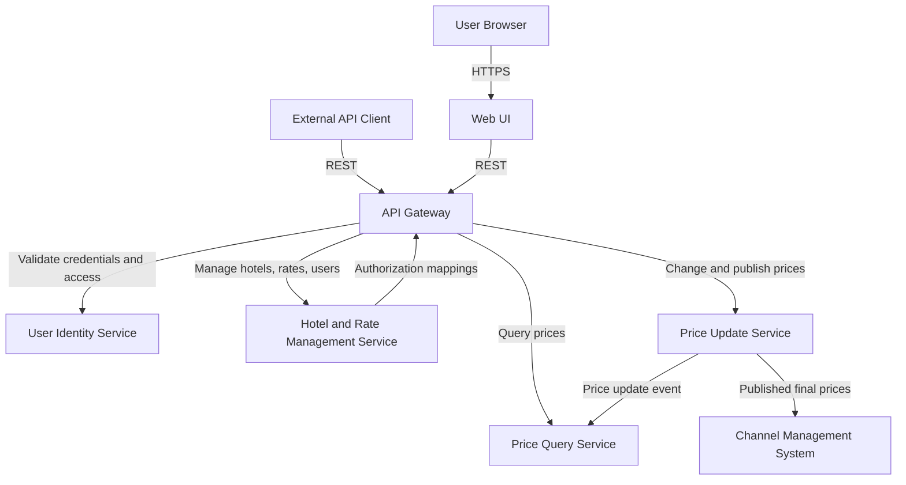
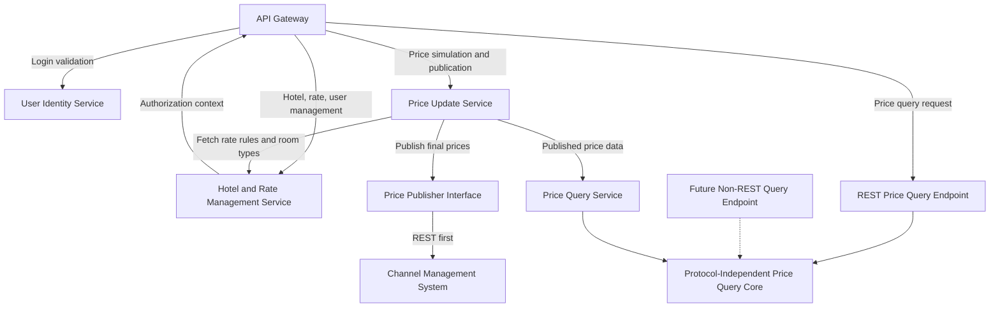
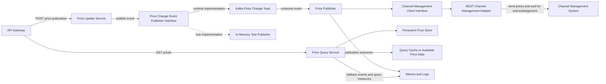
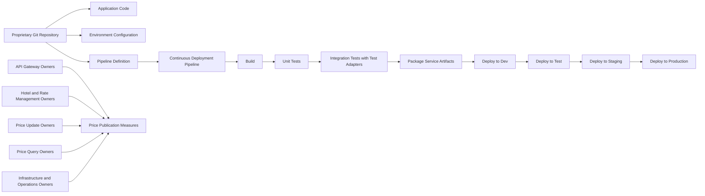

# Software Architecture Assignment 2 Report

## Project Metadata

- Team name: To be filled
- Team members: To be filled
- Assignment selection: C: Multi-agent
- LLM used: Qwen3-Max
- Framework: Spring AI Alibaba
- Run ID: run-20260525-055906

## Submission Note

This report was prepared from a real execution of the multi-agent ADD workflow. The original generated artifacts, conversation logs, and structured iteration snapshots are preserved under `artifacts/run-20260525-055906/`. Team member names and personal contributions are intentionally left blank for completion before final submission.

## 1. Output Results of ADD

### ADD Step 1

The design work began by reviewing the complete prior knowledge bundle supplied for the Hotel Pricing System. The reviewed drivers included the primary functionality requirements HPS-1 to HPS-6, the quality attributes QA-1 to QA-9, the architectural concerns CRN-1 to CRN-5, and the constraints CON-1 to CON-6. The system was treated as a greenfield replacement, so the purpose of the design was to make initial architectural decisions that could support later construction of the replacement system.

The workflow followed the fixed four-iteration plan:

1. Establishing an Overall System Structure
2. Identifying Structures to Support Primary Functionality
3. Addressing Reliability and Availability Quality Attributes
4. Addressing Development and Operations

### Iteration 1: Establishing an Overall System Structure

#### ADD Step 2

The selected drivers for this iteration were CRN-1, CON-6, CON-2, CON-5, QA-5, QA-3, and QA-4. These drivers required the initial architecture to establish a clear overall structure, favor a cloud-native direction, integrate with a cloud provider identity service, support initial REST integration, enforce authorized access, maintain pricing query availability, and support growth in price query volume.

#### ADD Step 3

The elements refined in this iteration were the system boundary, the major internal services, the browser-facing entry point, the external User Identity Service, and the Channel Management System integration. The iteration also identified the first set of runtime interfaces needed for login, price query, price change, hotel and rate management, and external publication.

#### ADD Step 4

The chosen design concepts were a cloud-native service decomposition, a single public gateway for browser and API entry, separated read and write responsibilities for price query and price update behavior, external identity validation through the User Identity Service, and containerized stateless deployment units. These concepts were selected because they directly support the cloud hosting constraint, REST-first integration constraint, query availability goal, scalability goal, and security goal.

#### ADD Step 5

The main elements instantiated were:

- Web UI: browser-based user access, aligned with CON-1 and the team's Angular knowledge in CRN-2.
- API Gateway: routes incoming requests, coordinates identity validation, and passes authorization context to backend services.
- Hotel and Rate Management Service: owns hotel information, room types, tax rates, rate definitions, business rules, and user permission mappings.
- Price Update Service: supports simulation, price changes, and publication initiation.
- Price Query Service: supports UI and external price queries.
- User Identity Service: validates credentials and supports the access control requirement.
- Channel Management System: receives published final prices so external systems can query them.

#### ADD Step 6

The main decisions were:

- Use separate services for hotel/rate management, price update, and price query responsibilities.
- Place browser and external API access behind a gateway.
- Keep identity validation outside the Hotel Pricing System and use authorization context inside backend services.
- Separate price query responsibilities from price update responsibilities so the query path can be scaled and kept available.
- Keep external integrations behind explicit interfaces so REST can be used first and future protocol additions remain possible.

#### ADD Step 7

The iteration achieved its goal by defining a traceable initial structure. The main residual risks were the exact protocol details of the User Identity Service, the reliability of price publication to the Channel Management System, the amount of load testing needed to prove scalability, and the need to allocate implementation responsibilities to actual team members later.

#### View Artifact

### Iteration 2: Identifying Structures to Support Primary Functionality

#### ADD Step 2

The selected drivers were HPS-1, HPS-2, HPS-3, HPS-4, HPS-5, HPS-6, QA-1, QA-5, and QA-6. The iteration goal was to refine the initial structure so that every primary function was assigned to architectural elements while also supporting the performance, security, and modifiability quality attributes.

#### ADD Step 3

The refined elements were the API Gateway, Hotel and Rate Management Service, Price Update Service, and Price Query Service. The main responsibilities refined were login coordination, authorization context propagation, hotel/rate/user management, simulation before price changes, final price publication, and price query handling for both UI and external clients.

#### ADD Step 4

The design used responsibility separation between query and update behavior, explicit service ownership for hotel/rate/user data, endpoint adapters around the price query core, and interfaces around external publication. These decisions were grounded in QA-1, QA-5, QA-6, CON-5, and CRN-2.

#### ADD Step 5

Responsibilities were allocated as follows:

- API Gateway: receives browser and API traffic, coordinates login with the User Identity Service, and forwards authorized requests.
- Hotel and Rate Management Service: supports HPS-4, HPS-5, and HPS-6 by managing hotels, rates, business rules, room types, tax rates, and user permissions.
- Price Update Service: supports HPS-2 by validating authorization, running simulation before changes are applied, and initiating price publication.
- Price Query Service: supports HPS-3 through a query core that can be reached through REST first and later through an additional non-REST endpoint without changing core components.
- Channel Management System interface: receives final prices after publication.

#### ADD Step 6

The main decisions were:

- Keep simulation in the Price Update Service because HPS-2 requires simulation before applying changes.
- Require backend authorization checks in price update and price query flows so users only see authorized hotel data and functions.
- Keep the Price Query Service core independent of the REST endpoint so QA-6 can be satisfied later.
- Use explicit interfaces for price publication so the initial REST integration does not force core component changes if a future protocol is added.

#### ADD Step 7

This iteration assigned all primary functions to concrete elements and strengthened traceability between use cases and services. The remaining risks were simulation data staleness, duplicated authorization checks across services, and the fact that full publication reliability would still need to be addressed in the reliability-focused iteration.

#### View Artifact

### Iteration 3: Addressing Reliability and Availability Quality Attributes

#### ADD Step 2

The selected drivers were QA-2, QA-3, QA-4, QA-8, QA-9, CON-5, CON-6, and CRN-4. The iteration goal was to strengthen reliability, availability, scalability, monitorability, and testability while preserving the service boundaries established in the first two iterations.

#### ADD Step 3

The refined elements were the Price Update Service, Price Query Service, publication path to the Channel Management System, internal event path from price changes to query readiness, and test/monitoring hooks for all critical price publication behavior.

#### ADD Step 4

The selected design concepts were durable asynchronous publication, explicit publication acknowledgement from the Channel Management System, retryable publication through a dedicated publisher element, query-side fallback behavior, horizontal scaling of stateless services, measurable price publication behavior, and injectable external dependency interfaces for testing.

#### ADD Step 5

The refined responsibilities were:

- Price Update Service: validates a price change, runs simulation, applies the final change, and emits a price change event through a publication interface.
- Price Publisher: receives price change events, calls the Channel Management System through a client interface, retries failed attempts, and marks delivery successful only after acknowledgement.
- Channel Management System client interface: hides the REST integration details and returns success, failure, and receipt information.
- Price Query Service: serves query traffic and can continue returning available price data during partial backend failures.
- Observability hooks: collect publication latency, success count, failure count, retry count, acknowledgement status, and fallback events.
- Test adapters: replace external services during integration testing so system elements can be tested independently of the User Identity Service, Channel Management System, and event infrastructure.

#### ADD Step 6

The main decisions were:

- Require Channel Management System acknowledgement before treating a publication as successful, directly supporting QA-2.
- Use an event-based publication path through Kafka, which is explicitly included in CRN-2, to make publication durable and retryable.
- Keep publication behind an interface so the REST-first constraint is preserved without making future protocols invasive.
- Add metrics and logs for every critical publication outcome so QA-8 can be satisfied.
- Provide test implementations for external dependencies so QA-9 can be met.

#### ADD Step 7

The iteration achieved its quality-attribute goal. Reliability was addressed through durable eventing, retry, and acknowledgement. Availability and scalability were addressed by keeping the query service separately deployable and scalable. Monitorability was addressed through publication measures, and testability was addressed through injectable interfaces. The remaining risks were weak acknowledgement semantics from the Channel Management System, limited realism of in-memory test implementations, and the need to define acceptable behavior when available query data becomes stale during failures.

#### View Artifact

### Iteration 4: Addressing Development and Operations

#### ADD Step 2

The selected drivers were QA-7, QA-8, QA-9, CRN-3, CRN-5, CON-3, CON-4, and CON-6. The iteration goal was to refine development, delivery, deployment, ownership, testing, and operational structures so the architecture could support the MVP in two months and the full release in six months.

#### ADD Step 3

The refined elements were the proprietary Git repository, environment configuration, continuous deployment pipeline, service ownership boundaries, integration test approach, and operational monitoring path.

#### ADD Step 4

The chosen design concepts were version-controlled deployment definitions, a continuous deployment pipeline with quality gates, component-based work allocation, environment-specific configuration without code changes, and operational measures for price publication. These concepts were directly grounded in QA-7, QA-8, QA-9, CRN-3, CRN-5, CON-3, CON-4, and CON-6.

#### ADD Step 5

The main operational elements were:

- Proprietary Git repository: stores application code, infrastructure definitions, and pipeline definitions.
- Continuous deployment pipeline: builds, tests, packages, and deploys services between environments.
- Environment manifests: define non-production deployment settings without code changes.
- Service ownership boundaries: map work to the API Gateway, Hotel and Rate Management Service, Price Update Service, Price Query Service, and supporting infrastructure responsibilities.
- Integration test stage: runs tests with replaceable external service adapters.
- Monitoring path: collects logs, health information, and price publication measures.

Actual member allocation is intentionally left blank because the team composition is not provided.

#### ADD Step 6

The main decisions were:

- Store pipeline definitions and environment configuration in the proprietary Git-based platform.
- Gate environment promotion on automated test success.
- Allocate work by component boundary rather than named team labels.
- Require integration tests that do not depend on external systems.
- Collect price publication success, failure, retry, acknowledgement, and latency measures.

#### ADD Step 7

The iteration achieved its development and operations goal. It supports deployability through environment configuration without code changes, supports continuous deployment through a pipeline structure, supports testability through replaceable external dependencies, and supports monitorability through price publication measures. The main residual risks are limitations of the proprietary Git platform, unknown team size, and possible schedule pressure from the two-month MVP target.

#### View Artifact

## 2. Interaction Cost Analysis

The assignment was completed using the multi-agent paradigm. The workflow separated the design activity into Requirements Analyst, Solution Architect, Quality Reviewer, Diagram Curator, and Iteration Moderator roles. This created more model turns than a single-prompt approach, but it also provided explicit review checkpoints and made each iteration easier to trace to ADD steps and architectural drivers.

- The way of completing the assignment: C: Multi-agent
- The LLM used: Qwen3-Max
- Number of Human Interactions (turns): 2
- Agent Turns: 24
- Token Consumption (K tokens): 123.37
- Time Cost (min): 16.00

## 3. Individual Reflection

### 3.1 Problems Encountered and Solutions Adopted

- Problem: Some model outputs used named technologies or pattern labels that were more specific than the assignment's prior knowledge.  
  Solution adopted: The final report was reviewed and conservative wording was used so that design decisions remained grounded in the provided drivers, constraints, and concerns.

- Problem: The original generated Mermaid output included syntax that was not standard Mermaid graph syntax.  
  Solution adopted: The final submission version preserves the same architectural content but rewrites the diagrams as valid `flowchart` diagrams.

- Problem: Four ADD iterations can become inconsistent if each round is treated independently.  
  Solution adopted: The workflow passed prior iteration summaries into later agent turns so that each round refined the previous decisions instead of restarting the design.

- Problem: The multi-agent process produced many intermediate responses and needed a way to support verification.  
  Solution adopted: The application archived full conversation logs, structured iteration JSON files, and a generated report so the result can be audited against the actual run.

### 3.2 Personal Contributions to the Group Work

| Name (Chinese) | Contributions |
| --- | --- |
| To be filled | To be filled |

## Appendix A. Run Artifacts

- Summary JSON: `artifacts/run-20260525-055906/summary.json`
- Original generated report: `artifacts/run-20260525-055906/report.md`
- Submission-ready report: `artifacts/run-20260525-055906/report-submission-ready.md`
- Conversation logs: `artifacts/run-20260525-055906/conversations/`
- Iteration snapshots: `artifacts/run-20260525-055906/iterations/`
- Recorded model turns: 24
