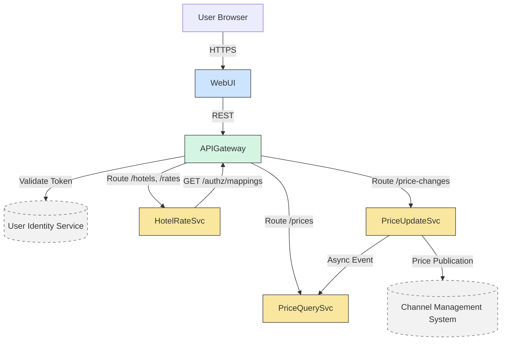

# Software Architecture Assignment 2 Report

## Project Metadata

- Assignment selection: C: Multi-agent
- LLM used: Qwen3-Max
- Run ID: run-20260525-055906
- Team name: Not provided
- Team members: Not provided

## Submission Note

This draft was generated from the multi-agent ADD workflow. Before submission, the team should review wording, verify that each architectural claim matches the latest run artifacts, and complete the individual reflection section with real group contributions.

## 1. Output results of ADD

### ADD Step 1

The architectural drivers reviewed before the iterations were the six primary use cases (HPS-1 to HPS-6), the nine quality attribute scenarios (QA-1 to QA-9), the five architectural concerns (CRN-1 to CRN-5), and the six constraints (CON-1 to CON-6). The design activity treated the case as greenfield development and used the fixed four-iteration plan from the assignment.

### Iteration 1: Establishing an Overall System Structure

- Iteration goal: Define the system context, identify major architectural containers (services or components), allocate high-level responsibilities among them, and specify initial interfaces—especially those related to user authentication, price querying, and integration with external systems—while adhering to cloud-native principles and REST-based interoperability.
- Selected drivers: CRN-1, CON-6, CON-2, CON-5, QA-5, QA-3, QA-4

#### ADD Step 2

Selected drivers include CRN-1 (establish overall structure), CON-6 (cloud-native approach), CON-2 (cloud identity and hosting), CON-5 (initial REST integrations), QA-5 (secure authorization), QA-3 (99.9% query uptime), and QA-4 (scalable to 1M queries/day). These shape system boundaries, deployment model, security, scalability, and external interfaces.

#### ADD Step 3

Refined elements include: system boundary with external actors (users, User Identity Service, Channel Management System); core internal containers realizing HPS-1 through HPS-6; primary inbound/outbound interfaces (UI, query API, management APIs, publication channel); and initial cloud-native deployment assumptions.

#### ADD Step 4

Chosen design concepts: cloud-native microservices architecture; API Gateway pattern; read-write separation (CQRS-inspired); externalized identity via cloud provider service; containerized deployment units. These satisfy selected drivers while enabling modifiability, deployability, and team allocation.

#### ADD Step 5

Instantiated elements: Web UI (Angular) serves browser clients; API Gateway handles authn/authz and routing; Hotel & Rate Management Service implements hotel/rate/user-permission logic and exposes /authz/mappings; Price Query Service serves fast price reads; Price Update Service handles simulations and publishes prices; external User Identity Service and Channel Management System are integrated via abstract interfaces. All internal services are stateless and containerized.

#### ADD Step 6

Key decisions: functional microservices enable independent scaling and modifiability; API Gateway centralizes security and protocol handling; read-write separation optimizes for query performance and availability; authentication is delegated externally while authorization uses explicit mappings; internal eventing and CMS integration are abstracted to preserve flexibility; all services are containerized for cloud deployability and CI/CD readiness.

#### ADD Step 7

Analysis confirms alignment with all selected drivers and iteration scope. Residual risks include ambiguity in identity protocol, potential reliability gap in synchronous price publication (to be addressed in Iteration 3), scalability assumptions under peak load, MVP scope pressure, and pending team allocation. The iteration goal is achieved with a compliant, traceable structural foundation.

#### View Artifact



### Iteration 2: Identifying Structures to Support Primary Functionality

- Iteration goal: Refine the internal structures of the microservices identified in Iteration 1 to directly support the six primary functional capabilities (HPS-1 through HPS-6), while ensuring compliance with performance (QA-1), security (QA-5), and modifiability (QA-6) requirements. This includes defining service responsibilities, data ownership boundaries, key runtime collaborations, and the simulation-to-publication workflow for price changes.
- Selected drivers: HPS-1 Log In, HPS-2 Change Prices, HPS-3 Query Prices, HPS-4 Manage Hotels, HPS-5 Manage Rates, HPS-6 Manage Users, QA-1 Performance, QA-5 Security, QA-6 Modifiability

#### ADD Step 2

The iteration goal is to refine internal microservice structures to support all six primary functionalities while satisfying QA-1 (sub-100ms price publication), QA-5 (authorization via User Identity Service), and QA-6 (support for future non-REST query endpoints).

#### ADD Step 3

The elements refined are: Hotel & Rate Management Service (HPS-4/5/6), Price Update Service (HPS-2), Price Query Service (HPS-3), API Gateway (HPS-1 coordination), and their interfaces—especially authorization context propagation, simulation input/output, price publication to CMS, and data ownership boundaries.

#### ADD Step 4

Design concepts applied include: CQRS (separating read/write paths), DDD bounded contexts (aligning services to domains), event-driven simulation workflow (side-effect-free preview), adapter pattern for identity (abstracting OAuth2/SAML), and protocol-agnostic query core (enabling REST/gRPC swappability).

#### ADD Step 5

Responsibilities allocated as follows: API Gateway handles OAuth2 login flow and propagates X-User-Id/X-Authorized-Hotels; Hotel & Rate Management owns hotel/rate/user metadata and provides auth context; Price Update fetches rate rules once per hotel per session (cached in-memory), validates authorization per request, and manages simulation/publication; Price Query validates hotel access per request and uses a protocol-agnostic core. Interfaces enforce synchronous rule fetching (first use only), abstract PricePublisher, and mandatory backend auth checks.

#### ADD Step 6

Key decisions recorded: (1) Synchronous fetch + in-memory cache for simulation data balances accuracy and MVP responsiveness; (2) Mandatory backend authorization checks enforce QA-5 via defense-in-depth; (3) OAuth2 redirect in API Gateway satisfies HPS-1 under CON-1/CON-2; (4) Protocol-agnostic query core enables QA-6. The Mermaid diagram captures service structure, data flows, auth validation points, and caching behavior.

#### ADD Step 7

Analysis confirms alignment with all selected drivers: primary functions are fully assigned, QA-1 is supported by cached simulation and async publication, QA-5 is enforced end-to-end via header validation in all backends, and QA-6 is enabled by adapter-based endpoints. Residual risks (cache staleness, auth logic duplication, publication reliability) are scoped for later iterations and consistent with MVP constraints.

#### View Artifact

```mermaid
componentDiagram
    title Refined Microservice Structure for Primary Functionality (Revised)

    component "API Gateway" as gateway {
        [UserAuthenticator Adapter]
        [OAuth2 Login Flow Handler]
        [Router]
    }

    component "Hotel & Rate\nManagement Service" as hrm {
        [Hotel CRUD]
        [Rate Rule Mgmt]
        [User Permission Mgmt]
        [Auth Context Provider]
    }

    component "Price Update\nService" as pu {
        [Simulation Engine<br><i>with in-memory cache</i>]
        [Price Publisher Interface]
        [Publication Workflow]
        [Auth Validator:<br>check X-Authorized-Hotels]
    }

    component "Price Query\nService" as pq {
        [Query Engine (Core)]
        [REST Adapter]
        [Price Projection Store]
        [Auth Validator:<br>check X-Authorized-Hotels]
    }

    component "User Identity\nService (Cloud)" as uis
    component "Channel Mgmt\nSystem (CMS)" as cms

    gateway --> uis : OAuth2 redirect / token validation
    gateway --> hrm : /hotels, /rates, /users,\n/auth-context?userId=...\n(headers propagated)
    gateway --> pu : /price-changes/*\n(headers: X-User-Id, X-Authorized-Hotels)
    gateway --> pq : /prices\n(same headers)

    pu --> hrm : GET /rate-rules?hotelId=...\n(GET /room-types)<br><i>once per hotel per session</i>
    pu ..> cms : PricePublisher.publish()\n(abstract interface)

    pu --> pq : PricePublished event\n(via internal messaging)

    note right of gateway
      Handles HPS-1 login via OAuth2
      redirect (CON-1, CON-2).
      Propagates auth context.
    end note

    note right of pu
      Simulation uses cached rules.
      Auth validated per request.
      Publication async & reliable (TBD).
    end note

    note left of pq
      Validates hotel access.
      Protocol-agnostic core
      supports QA-6.
    end note
```

### Iteration 3: Addressing Reliability and Availability Quality Attributes

- Iteration goal: Refine the existing microservice structure to concretely satisfy reliability (QA-2), availability (QA-3), scalability (QA-4), monitorability (QA-8), and testability (QA-9) requirements—without altering the high-level service boundaries or violating cloud-native (CON-6) and interoperability (CON-5) constraints established in Iterations 1 and 2.
- Selected drivers: QA-2 Reliability, QA-3 Availability, QA-4 Scalability, QA-8 Monitorability, QA-9 Testability, CON-5, CON-6, CRN-4

#### ADD Step 2

Selected drivers include QA-2 (Reliability), QA-3 (Availability), QA-4 (Scalability), QA-8 (Monitorability), QA-9 (Testability), CON-5 (REST-first with future protocol flexibility), CON-6 (cloud-native approach), and CRN-4 (avoid technical debt).

#### ADD Step 3

Elements to refine: Price Update Service (simulation-to-publication workflow), Price Query Service (resilience under load/failure), inter-service communication paths (event propagation, CMS integration), and test seams/observability hooks across price change and query flows.

#### ADD Step 4

Refined design concepts: (1) Acknowledged asynchronous publication requiring explicit CMS acknowledgment for delivery success; (2) Testable event emission via injectable PriceChangeEventPublisher interface; (3) Stale-while-revalidate caching with explicit fallback telemetry (metric + log); (4) Retention of protocol-agnostic, observable, and scalable foundations from prior iterations.

#### ADD Step 5

Updated elements: Price Update Service emits events via PriceChangeEventPublisher interface (with Kafka and InMemory implementations); Price Publisher consumes events and uses CmsClient interface (implemented by RestCmsAdapter) requiring CMS acknowledgment; Price Query Service serves stale data during outages and emits price_query_cache_fallback_total metric with structured logs; Observability Toolkit enhanced to capture fallbacks. Key data flows preserved: UI → API Gateway → Price Update Service → Kafka → Price Publisher → CMS; UI/External → API Gateway → Price Query Service → Redis → Persistent Store (fallback).

#### ADD Step 6

Key decisions: (1) Require CMS acknowledgment to satisfy QA-2’s 'received by CMS' clause; (2) Abstract Kafka production behind interface to enable full integration testing per QA-9; (3) Instrument cache fallbacks explicitly to ensure 100% reliability monitoring per QA-8; (4) Retain all prior structural decisions to avoid regression. Rationale aligns with MVP scope, cloud-native principles, and interface discipline to prevent technical debt.

#### ADD Step 7

Analysis confirms the refined design satisfies all selected quality attributes without violating prior structure. QA-2 is met via acknowledged delivery; QA-3 via stale-while-revalidate; QA-4 via stateless autoscaling; QA-8 via new fallback metric and logs; QA-9 via injectable interfaces for both CMS and Kafka. Residual risks include potential CMS acknowledgment weakness, limited Kafka test realism, and staleness visibility without correction—but all are mitigated within MVP constraints.

#### View Artifact

```mermaid
componentDiagram
    title Hotel Pricing System – Iteration 3 Refined Architecture

    package "User Interface / External Systems" {
        [Web UI] --> API_Gateway
        [External API Client] --> API_Gateway
    }

    component API_Gateway [
        API Gateway
    ]

    package "Services" {
        component Price_Update_Service [
            Price Update Service
        ]
        component Price_Query_Service [
            Price Query Service
        ]
        component Price_Publisher [
            Price Publisher
        ]
    }

    package "Interfaces & Implementations" {
        interface "PriceChangeEventPublisher" as EventPubInterface
        component "KafkaPriceEventPublisher" as KafkaPub
        component "InMemoryPriceEventPublisher" as InMemPub

        interface "CmsClient" as CmsClientInterface
        component "RestCmsAdapter" as RestCms

        EventPubInterface <.. Price_Update_Service : uses
        KafkaPub ..|> EventPubInterface
        InMemPub ..|> EventPubInterface

        CmsClientInterface <.. Price_Publisher : uses
        RestCms ..|> CmsClientInterface
    }

    package "Infrastructure" {
        component Kafka [
            Kafka\n(price-changes topic)
        ]
        component Redis [
            Redis Cache
        ]
        component Persistent_Store [
            Persistent Store\n(e.g., DB)
        ]
        component CMS [
            Channel Management\nSystem (CMS)
        ]
        component Observability_Toolkit [
            Observability Toolkit\n(metrics, logs)
        ]
    }

    %% Data Flows
    API_Gateway --> Price_Update_Service : POST /prices/publish
    API_Gateway --> Price_Query_Service : GET /prices

    Price_Update_Service --> EventPubInterface : publish(event)

    KafkaPub --> Kafka : produce
    Kafka --> Price_Publisher : consume

    Price_Publisher --> CmsClientInterface : publish(PriceData)
    RestCms --> CMS : REST call\n(await ack)

    Price_Query_Service --> Redis : read
    Redis -.-> Persistent_Store : on miss/failure
    Price_Query_Service --> Persistent_Store : direct fallback\n(if Redis fails)
    Price_Query_Service --> Observability_Toolkit : emit\nprice_query_cache_fallback_total\n+ structured log

    %% Notes
    note right of Price_Publisher
        Only marks success\nupon CMS acknowledgment\n(HTTP 2xx + confirmation)
    end note

    note right of Price_Query_Service
        Serves stale data during\noutages; logs/metrics\non every fallback
    end note

    style EventPubInterface fill:#f9f,stroke:#333
    style CmsClientInterface fill:#f9f,stroke:#333
```

### Iteration 4: Addressing Development and Operations

- Iteration goal: Refine development, deployment, delivery, team allocation, and operational structures to concretely support the MVP (due in two months) and the six-month full release, while ensuring traceability to the selected drivers and preserving prior architectural decisions.
- Selected drivers: QA-7 Deployability, QA-8 Monitorability, QA-9 Testability, CRN-3 Allocate work to members of the development team, CRN-5 Set up a continuous deployment infrastructure, CON-3 Code must be hosted on a proprietary Git-based platform already used by the company, CON-4 The initial release must be delivered in six months and an MVP must be demonstrated within two months, CON-6 A cloud-native approach should be favored

#### ADD Step 2

Selected drivers include QA-7 (Deployability), QA-8 (Monitorability), QA-9 (Testability), CRN-3 (Team allocation), CRN-5 (CI/CD infrastructure), CON-3 (Proprietary Git platform), CON-4 (MVP in 2 months / full release in 6), and CON-6 (Cloud-native). These define the scope for refining development and operational structures.

#### ADD Step 3

Elements to refine are: (1) environment strategy (dev/test/staging/prod), (2) delivery pipeline from source control through testing to deployment, (3) team ownership boundaries aligned to microservice components, and (4) operational support via logging, metrics, and health probes.

#### ADD Step 4

Adopted design concepts: (1) GitOps-style deployment using declarative manifests in the proprietary Git platform; (2) CI/CD pipeline with quality gates including integration tests using in-memory adapters; (3) component-based ownership mapped to service boundaries from prior iterations; (4) cloud-native observability with structured logs and outcome-labeled Prometheus metrics for price publication.

#### ADD Step 5

Architectural elements include: Git repository hosting code and pipeline definitions under /infra/ci; CI/CD pipeline enforcing build → test → deploy stages; Hotel & Rate Mgmt, Price Update, and Price Query services with defined REST APIs and outbound contracts; API Gateway handling auth and routing; Observability sidecar emitting metrics like price_publication_outcome{result=...} and structured logs. Responsibilities are allocated by component boundary to enable parallel development without assuming team size.

#### ADD Step 6

Key decisions: (1) Pipeline-as-code stored in Git under /infra/ci satisfies CON-3; (2) Outcome-labeled metrics and CMS response logging ensure 100% diagnostic coverage per QA-8; (3) Ownership defined by component, not named teams, respecting staffing uncertainty per prior knowledge; (4) Integration tests use in-memory adapters to fulfill QA-9; (5) Structured logs capture CMS payloads on failure to complement metrics. All decisions preserve prior architecture and avoid unsupported assumptions.

#### ADD Step 7

Analysis confirms alignment with all selected drivers and continuity with Iterations 1–3. The design supports MVP delivery in two months by scoping observability to price publication and enabling independent testing. Residual risks include potential Git platform limitations, staffing constraints, and monitoring backend compatibility—but mitigations are in place. The iteration goal is achieved.

#### View Artifact

```mermaid
graph LR
    subgraph "Proprietary Git Platform (CON-3)"
        A[Application Code] --> B[Infra Manifests: dev/test/staging/prod]
        A --> C[CI/CD Pipeline Definition<br><i>/infra/ci</i>]
    end

    C --> D[CI/CD Pipeline]
    D --> E[Build & Unit Test]
    E --> F[Integration Test<br><i>with in-memory adapters</i>]
    F --> G[Container Registry]
    G --> H[Deploy to Dev]
    H --> I[Deploy to Test]
    I --> J[Deploy to Staging]
    J --> K[Deploy to Prod]

    subgraph "Cloud-Native Runtime (CON-6)"
        L[API Gateway] --> M[Hotel & Rate Mgmt Service]
        L --> N[Price Update Service]
        L --> O[Price Query Service]
        
        M --> P[(AuthZ Context)]
        N --> Q[Kafka / In-Memory Event Publisher]
        N --> R[RestCmsAdapter → CMS]
        O --> S[Cache + Fallback]
    end

    subgraph "Observability (QA-8)"
        L --> T[Metrics/Logs<br><i>incl. price_publication_outcome{result=...}</i>]
        M --> T
        N --> T
        O --> T
        T --> U[Central Monitoring System]
    end

    subgraph "Component Ownership (CRN-3)"
        M -.-> V[Hotel & Rate Mgmt Owners]
        N -.-> W[Price Update Owners]
        O -.-> X[Price Query Owners]
        L & D & T -.-> Y[Infrastructure Maintainers]
    end
```

## 2. Interaction cost analysis

The assignment was completed with the multi-agent paradigm. The workflow separated the design activity into analyst, architect, reviewer, diagram, and moderator roles so that the ADD outputs could be produced with explicit internal verification and traceable reasoning.

- The way of completing the assignment: C: Multi-agent
- The LLM used: Qwen3-Max
- Number of Human Interactions (turns): 2
- Agent Turns: 24
- Token Consumption (K tokens): 123.37
- Time Cost (min): 16.00

## 3. Individual Reflection

### 3.1 Problems encountered and solutions adopted

- Problem: keeping the agents strictly within the provided prior knowledge while still producing concrete architectural decisions.
- Solution adopted: the workflow used role prompts, dialogue rules, and reviewer checks that explicitly rejected unsupported assumptions and forced the outputs to remain traceable to the assignment drivers.
- Problem: preserving consistency across four iterations while the design became more detailed.
- Solution adopted: each iteration reused the summarized outputs of previous iterations so later decisions could refine the design instead of restarting it.
- Problem: turning multi-agent output into material that is easy to submit and review.
- Solution adopted: the system archived conversation logs, iteration snapshots, and a report draft so the team could validate and polish the result efficiently before submission.

Replace or refine the points above so they reflect the actual issues your group observed during the final run.

### 3.2 Personal contributions to the group work

| Name (Chinese) | Contributions |
| --- | --- |
| To be filled | To be filled |

## Appendix A. Run Artifacts

- Summary JSON: artifacts/run-20260525-055906/summary.json
- Conversation logs: artifacts/run-20260525-055906/conversations/
- Iteration snapshots: artifacts/run-20260525-055906/iterations/
- Detailed report file: artifacts/run-20260525-055906/report.md
- Recorded model turns: 24
